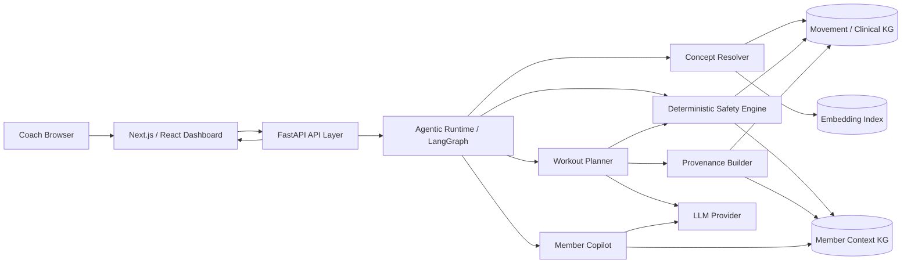
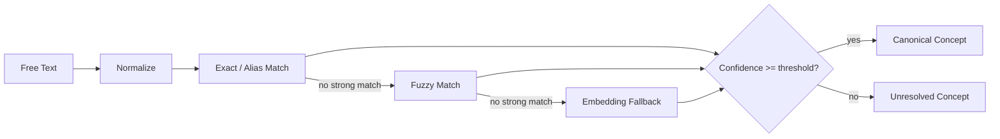
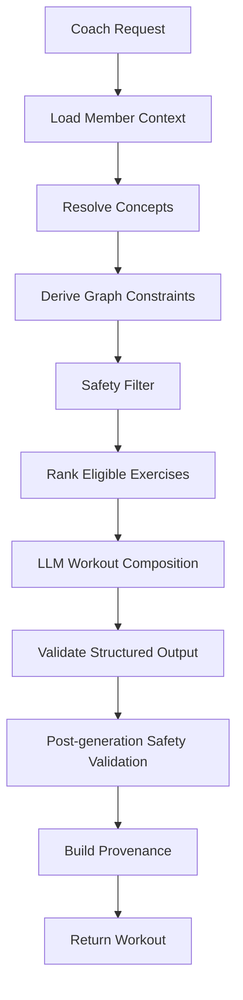

# ARCHITECTURE.md

# Future Coach Intelligence Platform — Architecture

## 1. Purpose

This document describes the architecture for Future's candidate assessment: a coach-facing dashboard with two integrated surfaces:

1. **Workout Generator** — generates safe, personalized, explainable workouts.
2. **Coach AI Copilot** — retrieves and summarizes longitudinal member context.

The design intentionally treats the **knowledge graph as the authority for safety and personalization constraints**. The LLM may interpret intent and compose a workout, but it cannot override graph-derived safety decisions.

The architecture is optimized for a one-day take-home while preserving staff-level boundaries, testability, explainability, and a credible path to production.

---

## 2. Core Design Principles

### 2.1 The graph, not the LLM, owns safety

The central invariant is:

> Unsafe exercises must be removed or down-ranked by deterministic graph traversal before the LLM can construct the final plan.

The LLM never receives the full unrestricted catalog as the authoritative candidate set.

### 2.2 Resolve language into canonical concepts

Coach input such as:

- "bad lower back"
- "left knee is bothering her"
- "DB only"
- "exclude deadlifts"

must be mapped to canonical graph entities before reasoning begins.

Resolution uses:

1. exact alias match
2. fuzzy match
3. embedding/vector fallback
4. confidence threshold
5. graceful unresolved state

### 2.3 Explain every important decision

Recommendations should carry provenance:

- which member facts were used
- which canonical concepts were resolved
- which graph paths were traversed
- why an exercise was included
- why an exercise was filtered
- whether the decision came from graph rules or the LLM

### 2.4 Keep the two graphs conceptually separate

The domain and member graphs solve different problems:

- **Movement / Clinical KG** = durable domain knowledge
- **Member Context KG** = longitudinal state for one member

They are connected at query time through shared concepts such as injuries, anatomy, equipment, goals, and exercise history.

### 2.5 Optimize for reviewability

Because this is a one-day assessment, the solution favors:

- small, meaningful ontology subsets
- deterministic rules
- typed APIs
- explicit module boundaries
- high-value tests
- visible reasoning in the UI

over production-scale infrastructure.

---

## 3. High-Level Architecture



---

## 4. Technology Choices

## Frontend — Next.js + React + TypeScript

Why:

- fast UI development
- strong typed API contracts
- straightforward charting and streaming
- easy component decomposition
- natural fit for a polished coach dashboard

Recommended UI libraries:

- Tailwind CSS
- shadcn/ui
- Recharts
- TanStack Query

The frontend contains no business-critical safety rules.

## Backend — FastAPI + Python

Why:

- natural fit for graph, embeddings, and LLM libraries
- Pydantic provides strong structured contracts
- concise implementation for a time-boxed assignment
- async support for LLM and graph calls
- easy unit testing with pytest

## Graph Store — Neo4j

Why:

- graph traversal is central to the assignment
- Cypher makes safety logic visible and reviewable
- easy to demonstrate anatomy hierarchy traversal
- supports graph visualization during review
- clear provenance paths

For the take-home, a single Neo4j instance can store two logical subgraphs identified by labels and relationship types.

A lightweight in-memory repository abstraction may be used in unit tests.

## Agent Runtime — LangGraph

Why:

- explicit workflow graph
- stateful multi-step orchestration
- keeps deterministic tools separate from generative steps
- easy to show where the LLM participates and where it does not

The runtime should remain intentionally small.

## LLM

Use one provider behind an interface such as:

```python
class LLMClient(Protocol):
    async def generate_structured(...): ...
    async def answer_grounded(...): ...
```

The architecture must not depend on a specific provider.

## Embeddings

Used only as the **third-pass concept-resolution fallback**.

Embeddings must never determine safety directly.

---

## 5. Repository Structure

```text
future-coach-ai/
├── frontend/
│   ├── app/
│   ├── components/
│   ├── features/
│   │   ├── workout-generator/
│   │   ├── copilot/
│   │   └── provenance/
│   └── lib/
│
├── backend/
│   ├── app/
│   │   ├── api/
│   │   ├── domain/
│   │   ├── graph/
│   │   │   ├── movement/
│   │   │   ├── member/
│   │   │   └── repository.py
│   │   ├── resolution/
│   │   ├── safety/
│   │   ├── agents/
│   │   ├── provenance/
│   │   ├── llm/
│   │   └── ingestion/
│   └── tests/
│
├── data/
│   ├── exercises.json
│   └── member-context.json
│
├── scripts/
│   └── seed_graph.py
│
├── docker-compose.yml
├── ARCHITECTURE.md
├── IMPLEMENTATION.md
└── README.md
```

---

# 6. Knowledge Graph 1 — Movement / Clinical Domain

## 6.1 Node Types

### Exercise

Properties:

```text
id
name
description
priority_tier
is_bilateral
bilateral_pair_id
```

### Muscle

```text
id
name
ontology_uri?
ontology_source?
```

### AnatomicalRegion

Represents joints and body regions.

Examples:

- Knee
- Left Knee
- Patellofemoral Joint
- Lumbar Region
- Shoulder

### MovementPattern

Examples:

- squat
- hinge
- horizontal_push
- vertical_pull

### Equipment

Examples:

- dumbbell
- kettlebell
- barbell
- bench

### InjuryCondition

Examples:

- knee pain
- ACL injury
- lumbar pain

### OntologyConcept

An explicit node for a published-ontology concept a local concept is mapped to.
Created **only** where the identifier was resolved against the source
terminology — 29 today, all SNOMED CT.

```text
id            e.g. "SNOMED_CT:72696002"
source        SNOMED_CT
code          72696002
uri           http://snomed.info/id/72696002
name          Knee region structure
version       2025_09_01
evidence      how the code was resolved and what confirmed it
status        verified
```

A concept reviewed and deliberately left ungrounded produces **no node and no
edge**; it is recorded in the `unmapped` register in `mappings.yaml` instead, so
the graph never asserts an external identity it cannot support. See the README's
*Ontology decisions* section for what is mapped and what is not.

---

## 6.2 Edge Types

```text
(:Exercise)-[:TARGETS]->(:Muscle)
(:Exercise)-[:STRESSES]->(:AnatomicalRegion)
(:Exercise)-[:REQUIRES]->(:Equipment)
(:Exercise)-[:HAS_PATTERN]->(:MovementPattern)

(:AnatomicalRegion)-[:PART_OF]->(:AnatomicalRegion)

(:InjuryCondition)-[:AFFECTS]->(:AnatomicalRegion)
(:InjuryCondition)-[:CONTRAINDICATES]->(:MovementPattern|:Exercise)

(:DomainConcept)-[:SKOS_EXACT_MATCH]->(:OntologyConcept)
(:DomainConcept)-[:SKOS_CLOSE_MATCH]->(:OntologyConcept)
(:DomainConcept)-[:SKOS_BROAD_MATCH]->(:OntologyConcept)
```

---

## 6.3 Anatomy Hierarchy

The hierarchy is essential for injury reasoning.

Example:

```text
Patellofemoral Joint
   └── PART_OF → Knee
          └── PART_OF → Lower Limb
```

If a member has a knee injury, an exercise that stresses a child structure of the knee must still be considered relevant.

Safety traversal therefore walks both ancestors and descendants where appropriate.

---

## 6.4 Ontology Grounding

Use ontology subsets intentionally.

### OPE

Use for:

- exercise concepts
- musculoskeletal concepts
- equipment concepts where useful

Do not ingest the ontology wholesale.

### COPPER

Use selectively for:

- personalization concepts
- behavior/adherence concepts
- recommendation context

### SNOMED CT

Use a small set of clinical anatomy/injury concepts relevant to the supplied synthetic member and exercise catalog.

For example:

- knee region
- lumbar region
- joint pain concepts

### SKOS

Use to represent mappings between:

- dataset taxonomy
- local canonical concepts
- ontology terms
- aliases

### PROV-O

Use conceptually for recommendation provenance.

The application does not need a complete RDF stack. A clean property graph aligned to PROV-O semantics is acceptable.

---

# 7. Knowledge Graph 2 — Member Context

## 7.1 Node Types

```text
Member
Goal
Preference
Injury
Equipment
Workout
WorkoutSession
ExercisePerformance
AdherenceObservation
BiomarkerObservation
LabResult
DEXAResult
ChatMessage
CoachBrief
ChurnSignal
```

## 7.2 Example Relationships

```text
(:Member)-[:HAS_GOAL]->(:Goal)
(:Member)-[:HAS_PREFERENCE]->(:Preference)
(:Member)-[:HAS_INJURY]->(:Injury)
(:Injury)-[:MAPS_TO]->(:InjuryCondition)

(:Member)-[:HAS_EQUIPMENT]->(:Equipment)

(:Member)-[:COMPLETED]->(:WorkoutSession)
(:WorkoutSession)-[:CONTAINS]->(:ExercisePerformance)

(:Member)-[:HAS_ADHERENCE]->(:AdherenceObservation)
(:Member)-[:HAS_BIOMARKER]->(:BiomarkerObservation)
(:Member)-[:HAS_LAB_RESULT]->(:LabResult)

(:Member)-[:PARTICIPATED_IN]->(:ChatMessage)
(:Member)-[:HAS_CHURN_SIGNAL]->(:ChurnSignal)
(:Member)-[:HAS_BRIEF]->(:CoachBrief)
```

Time-series observations retain timestamps rather than being collapsed into one member property.

---

# 8. Connecting the Graphs

The graphs connect through canonical domain nodes.

Example:

```text
Jordan
  └── HAS_INJURY → JordanLeftKneeInjury
          └── MAPS_TO → KneePain
                  └── AFFECTS → Knee

GobletSquat
  └── STRESSES → Knee
```

This enables deterministic reasoning without embedding the member directly into the domain ontology.

---

# 9. Concept Resolution

## 9.1 Pipeline



## 9.2 Example

Input:

```text
"Her left knee is bothering her and she only has DBs and a kettlebell."
```

Resolution:

```json
[
  {
    "text": "left knee",
    "concept": "anatomy:knee:left",
    "method": "alias",
    "confidence": 0.99
  },
  {
    "text": "DBs",
    "concept": "equipment:dumbbell",
    "method": "alias",
    "confidence": 0.98
  },
  {
    "text": "kettlebell",
    "concept": "equipment:kettlebell",
    "method": "exact",
    "confidence": 1.0
  }
]
```

## 9.3 Thresholds

Suggested:

```text
exact/alias     = 1.00
fuzzy accept    >= 0.88
embedding accept >= 0.82
below threshold = unresolved
```

Exact thresholds should be calibrated with tests rather than treated as universal constants.

## 9.4 Graceful Degradation

If a clinically meaningful concept cannot be confidently resolved:

- do not guess
- surface the unresolved phrase
- avoid silently applying an incorrect safety rule
- request clarification when interaction allows
- otherwise produce a conservative result

---

# 10. Deterministic Safety Engine

## 10.1 Inputs

```text
resolved coach constraints
member injuries
member equipment
explicit exclusions
member preferences
exercise catalog graph
```

## 10.2 Output

For every exercise:

```json
{
  "exercise_id": "goblet-squat",
  "status": "allowed | excluded | downranked",
  "score_adjustment": -25,
  "reasons": [],
  "graph_paths": []
}
```

## 10.3 Safety Rules

### Rule A — Explicit exclusion

If the coach says "exclude deadlifts":

1. resolve `deadlift` to a canonical movement/exercise family
2. traverse variants
3. exclude all mapped variants

### Rule B — Injury anatomy

For every member injury:

1. map injury to anatomical region
2. expand related anatomy through `PART_OF`
3. find exercises with `STRESSES` relationships into that region/substructure
4. exclude or down-rank based on severity policy

### Rule C — Contraindication

Traverse:

```text
InjuryCondition
  → CONTRAINDICATES
  → MovementPattern / Exercise
```

### Rule D — Equipment

An exercise is eligible only if its required equipment is satisfied by the member's available set.

### Rule E — Preferences

Preferences influence ranking, not hard safety, unless explicitly marked as exclusions.

---

## 10.4 Example Traversal

```text
Jordan
 → HAS_INJURY
 → Left Knee Pain
 → MAPS_TO
 → Knee Pain
 → AFFECTS
 → Knee

Goblet Squat
 → STRESSES
 → Patellofemoral Joint
 → PART_OF
 → Knee
```

Decision:

```text
Goblet Squat: DOWNRANKED or EXCLUDED
Reason: exercise stresses anatomy inside injured region
Source: deterministic graph traversal
```

---

# 11. Workout Generation Runtime

## 11.1 Workflow



## 11.2 LLM Responsibilities

The LLM may:

- interpret workout intent
- choose among already-approved candidate exercises
- organize warmup/main/cooldown
- produce sets/reps/rest
- explain recommendations in natural language

The LLM may not:

- override excluded exercises
- invent equipment availability
- invent member injuries
- invent member history
- determine whether an injury constraint applies

## 11.3 Defense in Depth

After the LLM returns a structured plan, run every selected exercise back through the deterministic safety engine.

If any exercise fails:

- reject it
- optionally replace it from the safe candidate pool
- record the correction in provenance

This proves safety does not rely on prompt compliance.

---

# 12. Provenance Model

Each recommendation should expose:

```json
{
  "exercise": "Dumbbell Romanian Deadlift",
  "decision": "included",
  "reasons": [
    "matches hinge movement intent",
    "required equipment is available",
    "no graph-derived knee contraindication found"
  ],
  "evidence": [
    {
      "path": [
        "Dumbbell Romanian Deadlift",
        "REQUIRES",
        "Dumbbell",
        "AVAILABLE_TO",
        "Jordan"
      ]
    }
  ],
  "decision_source": "knowledge_graph"
}
```

Filtered exercises should also be visible.

This is important because the assessment explicitly asks what was filtered out for safety.

---

# 13. Coach AI Copilot

## 13.1 Responsibilities

The copilot answers member-specific questions such as:

- Show me the brief
- How is adherence trending?
- Sleep this week
- What changed since last week?
- Plot adherence trend
- Compare the last four weeks
- Is this member showing churn risk?

## 13.2 Retrieval Strategy

Use structured graph queries first.

Example:

```text
Question: "How's adherence trending?"
    ↓
Intent classification
    ↓
Graph query for adherence observations
    ↓
Compute trend
    ↓
Provide compact structured evidence to LLM
    ↓
Grounded response + optional chart payload
```

Do not send the entire member JSON to the LLM for every question.

## 13.3 Chart Responses

API response can include:

```json
{
  "answer": "Adherence has declined over the last four weeks...",
  "citations": [...],
  "chart": {
    "type": "line",
    "x": ["W1", "W2", "W3", "W4"],
    "series": [
      {
        "name": "Adherence",
        "values": [0.86, 0.78, 0.71, 0.62]
      }
    ]
  }
}
```

The frontend renders chart payloads deterministically.

---

# 14. API Design

## POST /api/workouts/generate

Request:

```json
{
  "member_id": "jordan-rivera",
  "prompt": "45 minute lower body workout. Knee is bothering her. DB and kettlebell only.",
  "duration_minutes": 45
}
```

Response:

```json
{
  "workout": {
    "warmup": [],
    "main": [],
    "cooldown": []
  },
  "resolved_concepts": [],
  "filtered_exercises": [],
  "provenance": []
}
```

## POST /api/copilot/chat

```json
{
  "member_id": "jordan-rivera",
  "message": "How is adherence trending?"
}
```

## GET /api/members/{member_id}

Returns the coach-facing member summary.

## GET /api/members/{member_id}/history

Returns workout/chat timeline data.

## GET /api/graph/exercises/{exercise_id}/provenance

Optional endpoint for the graph-inspector panel.

---

# 15. Frontend Experience

## Dashboard layout

```text
┌────────────────────────────────────────────────────────────┐
│ Jordan Rivera    Goals | Injury | Equipment | Adherence   │
├───────────────────────────────┬────────────────────────────┤
│                               │                            │
│ Workout Generator             │ AI Copilot                 │
│                               │                            │
│ prompt                        │ quick prompts              │
│ duration                      │ chat                       │
│                               │ charts                     │
│ generated plan                │ member brief               │
│                               │                            │
├───────────────────────────────┴────────────────────────────┤
│ Safety & Provenance Inspector                              │
└────────────────────────────────────────────────────────────┘
```

## Provenance inspector

For each exercise show:

```text
Goblet Squat                  FILTERED

Reason
Potential knee stress

Graph path
Goblet Squat
  → STRESSES
Patellofemoral Joint
  → PART_OF
Knee

Member condition
Jordan
  → HAS_INJURY
Left Knee Pain
  → AFFECTS
Knee

Decision source
Knowledge Graph ✓
LLM ✕
```

This makes the assignment's central architectural requirement visible to the reviewer.

---

# 16. Testing Strategy

High-value tests are prioritized over broad shallow coverage.

## Concept Resolver

Test:

- exact match
- aliases
- fuzzy typo
- embedding fallback
- below-threshold unresolved input
- ambiguous terms
- "bad lower back"
- "DB only"

## Safety Engine

Test:

- knee injury excludes/down-ranks knee-stressing exercises
- child anatomy under knee is included in traversal
- unavailable barbell removes barbell-only exercises
- dumbbell/kettlebell alternatives remain
- "exclude deadlifts" removes deadlift variants
- preference affects ranking but not safety
- LLM-selected unsafe exercise is rejected during post-validation

## Copilot

Test:

- adherence answer uses graph data
- missing data is not invented
- chart payload matches underlying observations

---

# 17. Performance

Target:

- end-to-end AI interaction under ~5 seconds
- graph queries typically under 100 ms locally
- resolver avoids embedding lookup for exact/fuzzy matches
- LLM sees only compact safe candidate sets and relevant context
- member copilot retrieves task-specific slices rather than entire history

---

# 18. Observability

For each workout request log:

```text
request_id
member_id
resolver matches + confidence
graph queries
number of candidates before safety
number filtered
filter reasons
LLM latency
LLM token usage
post-validation corrections
total latency
```

Never log secrets.

In a production system, sensitive member data would require stricter controls than this synthetic assessment environment.

---

# 19. Production Evaluation

## Safety

Track:

- unsafe recommendation rate
- graph-filter escape rate
- false-positive filter rate
- unresolved clinical concept rate
- human coach override rate

The most important safety target is effectively:

```text
unsafe exercise survives deterministic post-validation = 0
```

## Recommendation Quality

Track:

- coach acceptance rate
- exercise replacement rate
- plan regeneration rate
- workout completion
- adherence after recommendation
- diversity vs repetition
- goal alignment

## Concept Resolution

Track:

- exact resolution accuracy
- fuzzy resolution accuracy
- embedding fallback precision
- unresolved rate
- false canonicalization rate

## Copilot Retrieval

Track:

- factual grounding accuracy
- retrieval relevance
- unsupported claim rate
- chart correctness
- task completion time for coaches

---

# 20. Failure Modes

## LLM invents an unsafe exercise

Mitigation:

- safe candidate whitelist
- structured output schema
- deterministic post-generation validation

## Resolver maps a phrase incorrectly

Mitigation:

- confidence thresholds
- alias curation
- ambiguity handling
- unresolved states
- evaluation dataset

## Graph lacks a relevant anatomical relationship

Mitigation:

- surface incomplete provenance
- conservative policy
- ontology review
- graph coverage monitoring

## Member data is missing

Mitigation:

- explicitly report insufficient evidence
- do not infer unknown clinical state

## Graph service unavailable

Safety-sensitive generation should fail closed rather than silently ask the LLM to make the safety decision.

---

# 21. Trade-offs

## Neo4j vs an in-memory graph

Neo4j adds setup cost but makes the central evaluation criterion—real graph reasoning—far more visible and defensible.

## LangGraph vs handwritten orchestration

The workflow is small enough to hand-code. LangGraph is used because the assessment explicitly values agentic workflow design and it provides an understandable execution graph. It should not be used to hide ordinary deterministic functions behind unnecessary "agents."

## Ontology subset vs full ontology ingestion

A curated ontology subset is preferred because:

- one-day scope
- easier semantic review
- lower accidental complexity
- demonstrates intentional ontology modeling

## Embeddings vs LLM concept resolution

Embedding fallback is deterministic enough to measure and threshold. Using an LLM alone for canonicalization would make resolution harder to audit and reproduce.

---

# 22. Key Architectural Invariants

1. **LLM output cannot bypass the safety engine.**
2. **Safety is derived from graph relationships, not prompt instructions.**
3. **Unknown concepts are not silently guessed.**
4. **Member facts shown by the copilot must come from retrieved member data.**
5. **Every important recommendation can expose a provenance path.**
6. **Only synthetic data is used in this assessment.**
7. **The system remains runnable locally with minimal setup.**

---

# 23. What I Would Build Next in Production

With more time:

- production ontology ingestion pipeline
- richer SNOMED CT mapping
- graph versioning
- graph-rule configuration
- clinician-reviewed safety policies
- longitudinal personalization features
- coach feedback learning loop
- evaluation datasets
- automated hallucination/grounding evaluation
- distributed tracing
- streaming chat
- role-based access control
- feature flags
- model/provider fallback
- audit trail persistence
- real graph visualization

---

## 12. Evaluation and observability

Two systems answering two different questions. They are shown together on the
System Quality dashboard and deliberately never blended.

### 12.1 Offline evaluation

```text
scripts/run_evals.py
   -> EvaluationRunner (app/evaluation/runner.py)
        -> EvalCase corpus (app/evaluation/cases.py)   71 cases, 8 categories
        -> real code paths: SafetyEngine, LangGraph workflow, MCP tools
   -> EvaluationRun (metrics, invariants, per-case results)
   -> EvaluationArtifactStore -> artifacts/evals/<run>.json + latest.json
```

Design constraints:

- Cases are **data**, not code. A reviewer can read what the system is expected
  to do without reading the harness.
- Every metric carries `numerator` / `denominator`. A percentage is always
  derived from a ratio the caller can check.
- Categories are never averaged. One blended score would let a safety escape
  hide behind a good resolver run.
- Invariants are **computed from case outcomes**. An invariant with no covering
  case does not hold - absence of a failure is not a demonstration.
- `unsafe_escape` is first-class and must be 0.

Artifacts are JSON on disk, not a database: append-only, small, diffable, and
committable next to the code that produced them.

### 12.2 Runtime tracing

```text
route handler
   -> graph_call_scope()            (ContextVar counter)
   -> workflow.run(...)             (no tracing code inside)
   -> build_workflow_trace(state)   (post-hoc projection)
   -> TraceStore                    (bounded in-process ring buffer)
```

The load-bearing property: **removing the tracing layer cannot change a safety
decision.** Traces are assembled *after* a run from state that already exists,
so `SafetyEngine`, the ranker and the validator contain no instrumentation. A
test asserts identical decisions with and without the layer.

The single exception is `InstrumentedGraphRepository`, a counting pass-through
that delegates every call untouched and increments an integer.

### 12.3 Trace privacy

The trace models have **no field** for a member payload, chat history, labs, a
prompt body, a coach question, an MCP payload, or an authorization header - so
a future caller cannot add one by passing the wrong argument. Recorded instead:
ids, durations, zone, aggregate counts, rule ids, resolver *method* counts, and
the classified copilot intent.

Absent values stay absent: token usage is `null` with the offline stub rather
than 0, and `graph_query_count` is `null` when no counter was installed.

### 12.4 System Quality dashboard

Route `/system`, sidebar item **Quality**. Reads
`GET /api/system/evaluations/latest`, `/api/system/evaluations`,
`/api/system/traces` and `/api/system/traces/{request_id}` - all read-only.

Case detail reuses `DecisionPaths`, the same component the coach graph panel
uses. There is deliberately no second provenance renderer: two renderers of the
same evidence eventually disagree, and the one in the engineering dashboard is
the one nobody would notice drifting.


---

## 13. Knowledge Graph Explorer

A read-only application feature for inspecting the graph the app reasons on.
Explicitly **not** Neo4j Browser: no Cypher box, no Bolt URI, no credential, no
write path.

```text
React (/graph)
   -> FastAPI  /api/graph/*            (GET only)
   -> GraphRepository.search_nodes / get_node / get_neighborhood
   -> Neo4j (topology via Cypher) | in-memory projection
```

### 13.1 Boundary

The three repository methods are the whole surface. The client names a node and
a depth; it cannot express a traversal the API did not design. There is no
method that accepts a query language and none that writes.

### 13.2 What is exposed

* `EXPLORABLE_KINDS` gates traversal. Member health nodes (LabResult,
  DEXAResult, BiomarkerObservation, ChatMessage, CoachBrief, ChurnSignal,
  AdherenceObservation, WorkoutSession) are unreachable - absent from search,
  from neighborhoods and from the legend. `HAS_INJURY` / `HAS_EQUIPMENT` still
  show how member context joins the clinical graph.
* `PROPERTY_ALLOWLIST` gates properties per node kind. An ingestion field added
  later is invisible until deliberately listed.
* Limits: search <= 50, depth <= 2, nodes <= 150, with `truncated` and
  `omitted_count` reported rather than silently applied.

### 13.3 Backend split

Neo4j decides the **topology** (which nodes match, which edges exist) via
parameterised read-only Cypher constants; the validated projection supplies the
**typed view** (allowlisted properties, ontology grounding). This is the same
division `list_exercises` has always used, and it means a drift between what
was seeded and what the application reasons on surfaces as a parity failure.

### 13.4 Reuse, not duplication

* Safety mode calls the existing `SafetyEngine` and projects through the
  existing `build_graph_reasoning`, then renders with `DecisionPaths`.
* Ontology mode renders the Phase 1 mapping set through `GroundingDetail`.

No provenance logic, safety logic or grounding data is re-implemented here.


---

## 14. Render deployment

```text
                          INTERNET
                             |
            +----------------+----------------+
            |                                 |
       Frontend (web, node)            Backend (web, python)
       Next.js                         FastAPI REST + /mcp
            |                                 |
            +----------- HTTPS ---------------+
                                              |
                                              | private network, Bolt 7687
                                              v
                                    Neo4j (pserv, image)
                                    neo4j:5.26-community
                                              |
                                              v
                                    persistent disk /data
```

### 14.1 Trust boundary

The backend is the only service with graph credentials. Neo4j is a private
service and receives no public URL; port 7687 is never reachable from a
browser. The read-only Knowledge Graph Explorer at `/graph` replaces Neo4j
Browser as the inspection surface.

### 14.2 Backend selection

`GRAPH_BACKEND=neo4j` selects `Neo4jGraphRepository` for every consumer -
workout generation, SafetyEngine, provenance, graph reasoning, explorer, MCP
tools and Copilot - because all of them resolve through the one composition
root. There is no per-feature backend choice and, in neo4j mode, no fallback:
an unreachable graph makes the service unready rather than changing the safety
implementation underneath it.

### 14.3 Bootstrap ownership

FastAPI's lifespan owns it. A Render disk is reachable only by its own service,
so any bootstrapper must go over Bolt; putting it in the lifespan means one
code path seeds locally, in CI and on Render, and the component that verifies
the seed is the one that will serve the queries.

Idempotence comes from `MERGE` on stable keys plus a `SeedMetadata` version
marker (outside `EXPLORABLE_KINDS`, so invisible to the explorer). Bootstrap is
never destructive - `wipe=False` always.

### 14.4 Health model

`/health/live` reports process liveness and never touches the graph.
`/health/ready` reports reachability and seed verification and answers 503 when
either fails; it is the configured `healthCheckPath`. Neither exposes a URI,
credential or stack trace.
