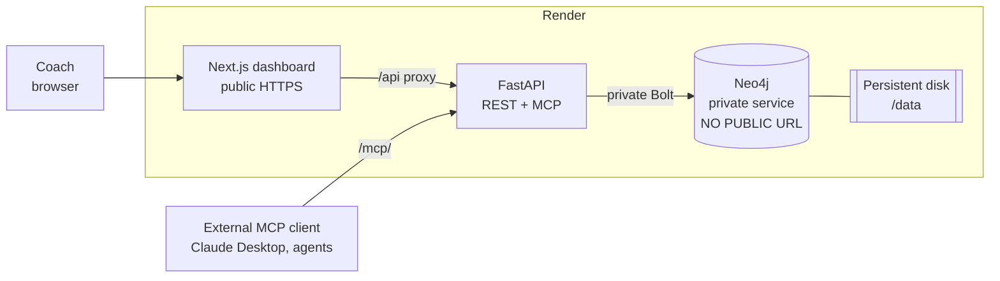
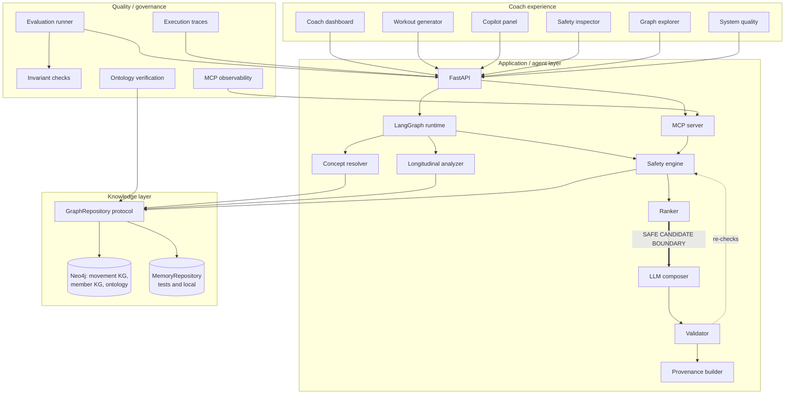
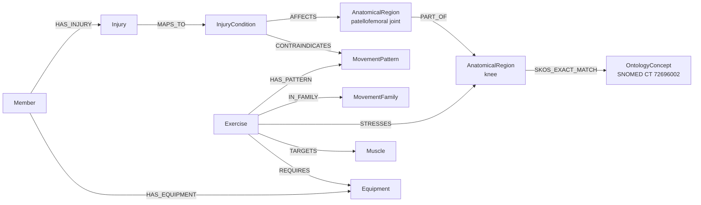
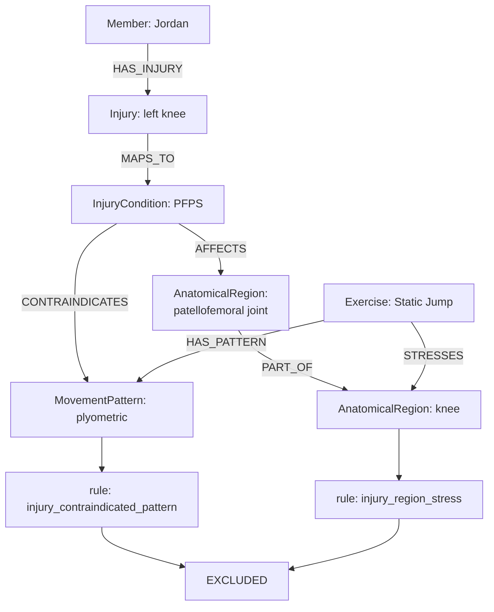
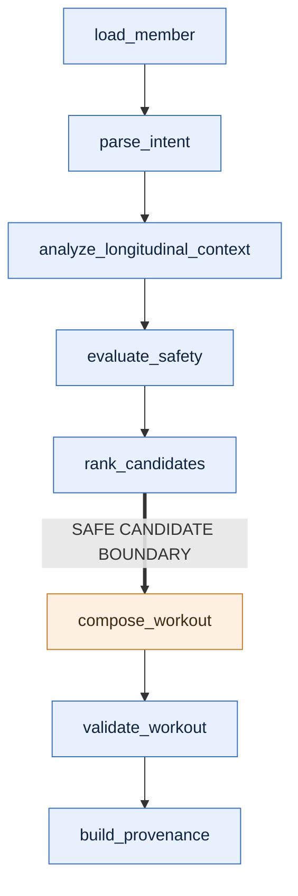
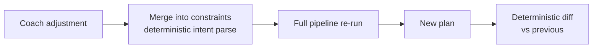
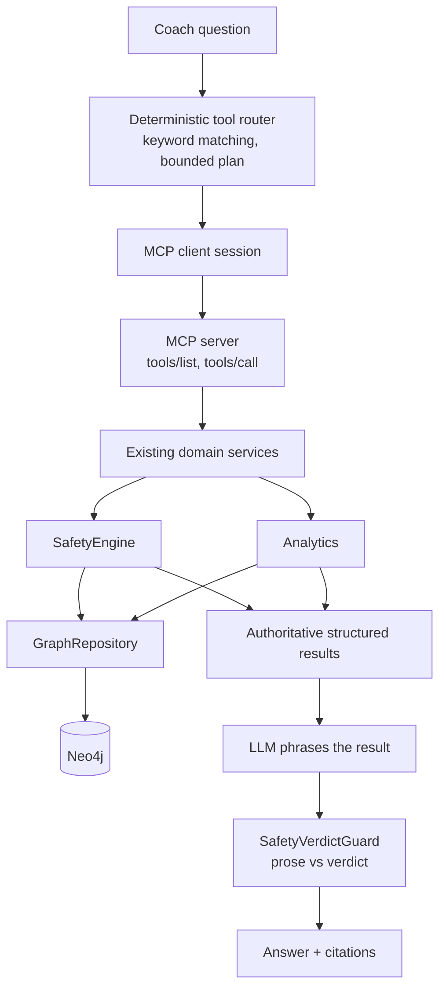
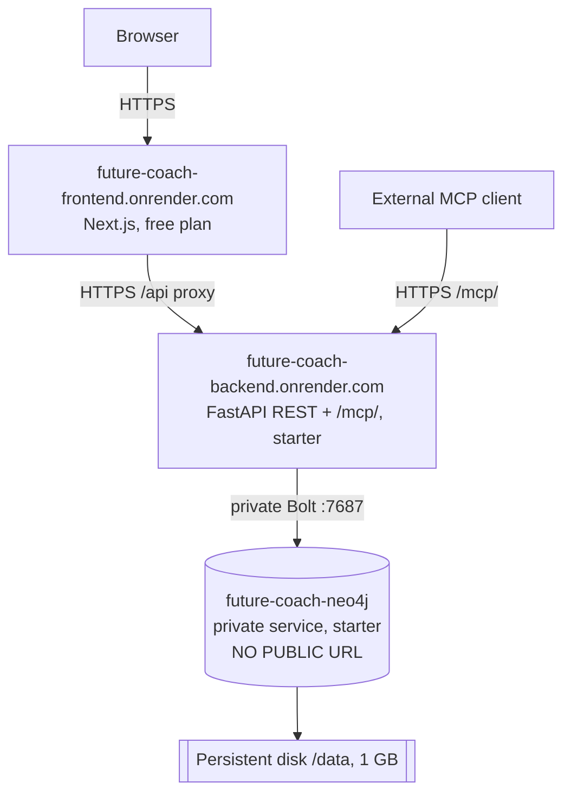

# Future Coach AI — Architecture

The deep technical document. [README.md](README.md) is the product-level tour;
this is the design defence — invariants, boundaries, failure modes and the
reasoning behind each decision.

**Contents**

1. [Executive architecture summary](#1-executive-architecture-summary)
2. [Design invariants](#2-design-invariants)
3. [System context](#3-system-context)
4. [Component architecture](#4-component-architecture)
5. [Knowledge graph model](#5-knowledge-graph-model)
6. [Ontology grounding](#6-ontology-grounding)
7. [Concept resolution](#7-concept-resolution)
8. [Safety engine](#8-safety-engine)
9. [LangGraph workflow](#9-langgraph-workflow)
10. [Longitudinal reasoning](#10-longitudinal-reasoning)
11. [Composition and validation](#11-composition-and-validation)
12. [Interactive adjustment](#12-interactive-adjustment)
13. [Provenance](#13-provenance)
14. [Coach Copilot and MCP](#14-coach-copilot-and-mcp)
15. [Knowledge Graph Explorer](#15-knowledge-graph-explorer)
16. [Evaluation and observability](#16-evaluation-and-observability)
17. [Repository abstraction](#17-repository-abstraction)
18. [Render deployment architecture](#18-render-deployment-architecture)
19. [Security and privacy boundaries](#19-security-and-privacy-boundaries)
20. [Failure modes](#20-failure-modes)
21. [Performance characteristics](#21-performance-characteristics)
22. [Architecture decisions and trade-offs](#22-architecture-decisions-and-trade-offs)

---

## 1. Executive architecture summary

A coach-facing system with two surfaces — a **workout generator** and a
**member-context copilot** — over two knowledge graphs, deployed on Render with a
private Neo4j.

The organising principle is a single sentence:

> **The graph decides safety; the LLM composes only from graph-approved
> candidates.**

Everything structural follows from it. Safety is computed by deterministic graph
traversal *before* a model is invoked. The model receives an already-filtered
candidate set, so it has no mechanism to make an excluded exercise eligible.
Whatever it returns is re-checked against the same decisions afterwards. Safety
is therefore a property of the system's shape, not of prompt wording.

Three consequences are worth stating up front, because they explain choices that
would otherwise look over-engineered:

- **One safety implementation.** `SafetyEngine` is the only component that
  decides eligibility. REST, MCP, the Copilot and the Graph Explorer all call
  it. None re-implement a rule, and parity tests assert they agree.
- **Explanation is a product feature, not logging.** Every exclusion carries the
  rule that produced it and the graph path that justified it, which is why the
  store is a graph rather than a set of tables.
- **The deployment is part of the design.** Real Neo4j, private, persistent, with
  readiness that fails closed rather than degrading silently to an in-memory
  store.

**Current measured state:** 71/71 evaluation cases, 0 unsafe escapes, 12/12
invariants, 29 verified ontology mappings, 7 MCP tools, 237 nodes / 529 edges,
502 backend tests green on both graph backends, 199 frontend tests.

---

## 2. Design invariants

These are the properties the system is built to hold. Each is enforced in code
and covered by tests; where an evaluation case proves it, the case category is
named.

| # | Invariant | How it is enforced |
|---|---|---|
| 1 | **Safety is deterministic.** No model participates in an eligibility decision. | `SafetyEngine` is pure graph traversal plus set logic. `safety` cases. |
| 2 | **The LLM cannot make an excluded exercise eligible.** | Composition runs after `rank_candidates` and receives only the safe set; `validate_workout` re-checks output. `validation` cases, incl. adversarial. |
| 3 | **Safety logic exists in exactly one place.** | MCP tools, Copilot and Explorer call `SafetyEngine`; a parity test asserts MCP ≡ direct engine. |
| 4 | **The MCP layer implements no safety rules.** | Tools are adapters over domain services; `mcp_safety_parity` metric. |
| 5 | **The Graph Explorer implements no safety rules.** | It renders decisions from the same repository and engine; explorer/repository parity tests. |
| 6 | **Longitudinal personalization cannot override safety.** | Exclusion happens before ranking, and `MAX_LONGITUDINAL_ADJUSTMENT` (6.0) is strictly less than `SMALLEST_SAFETY_PENALTY` (8.0) — arithmetically incapable of reversing an exclusion. |
| 7 | **Missing evidence stays missing.** | Below-threshold resolution returns `unresolved`; absent metrics return `insufficient_data`. Neither is filled in by a model. |
| 8 | **No fabricated graph relationships.** | Provenance distinguishes traversal evidence from set operations; a set difference is never rendered as an edge. |
| 9 | **Ontology metadata does not alter safety semantics.** | Mappings are annotations on local concepts; a test asserts safety output is byte-identical with and without them. |
| 10 | **A Neo4j failure never silently switches storage engines.** | In `neo4j` mode there is no memory fallback; `/health/ready` returns 503. |
| 11 | **The browser never receives graph credentials.** | Only FastAPI holds them; the deployed client bundle is scanned for Bolt URIs, passwords and the private hostname. |
| 12 | **Observability never records protected raw payloads.** | Traces store intent, timings and counts — never the question, member payload, labs, headers or MCP bodies. |

---

## 3. System context



The browser talks to exactly one origin. Neo4j is reachable only from the
backend, over Render's private network; it has no public URL, no public Bolt
port and no exposed Browser.

---

## 4. Component architecture



The thick edge is the trust boundary. Everything upstream of it is
deterministic; the composer is the only component downstream, and the validator
immediately re-subordinates its output to the engine.

---

## 5. Knowledge graph model

Two graphs, deliberately separate, joined only through canonical domain nodes.
The deployed graph holds **237 nodes across 21 kinds and 529 edges across 27
types**.

### 5.1 KG1 — movement / clinical domain

| Node | Count | Notes |
|---|---|---|
| `Exercise` | 50 | `priority_tier`, `is_bilateral`, `bilateral_pair_id` |
| `MovementPattern` | 36 | `squat`, `hinge`, `horizontal_push`, `plyometric` … |
| `Equipment` | 32 | `dumbbell`, `kettlebell`, `barbell`, `bench` … |
| `OntologyConcept` | 29 | verified external identifiers only |
| `Muscle` | 19 | |
| `AnatomicalRegion` | 14 | joints and regions, hierarchical |
| `MovementFamily` | 9 | groups patterns for family-level exclusion |
| `InjuryCondition` | 3 | clinical conditions, not member instances |



The **`PART_OF` closure is doing real safety work**, and it is the clearest
argument for a graph. A knee injury must implicate an exercise that stresses the
patellofemoral joint even though the strings differ and no direct edge exists.
Traversal expresses that; a `WHERE region = 'knee'` filter does not.

### 5.2 KG2 — member context

One synthetic member, Jordan Rivera, with time-stamped observations rather than
collapsed properties:

```text
(:Member)-[:HAS_GOAL]->(:Goal)                    (:Member)-[:HAS_INJURY]->(:Injury)
(:Member)-[:HAS_PREFERENCE]->(:Preference)        (:Injury)-[:MAPS_TO]->(:InjuryCondition)
(:Member)-[:HAS_EQUIPMENT]->(:Equipment)          (:Member)-[:COMPLETED]->(:WorkoutSession)
(:WorkoutSession)-[:CONTAINS]->(:ExercisePerformance)
(:Member)-[:HAS_ADHERENCE]->(:AdherenceObservation)
(:Member)-[:HAS_BIOMARKER]->(:BiomarkerObservation)
(:Member)-[:HAS_LAB_RESULT]->(:LabResult)         (:Member)-[:HAS_DEXA_RESULT]->(:DEXAResult)
(:Member)-[:PARTICIPATED_IN]->(:ChatMessage)      (:Member)-[:HAS_BRIEF]->(:CoachBrief)
(:Member)-[:HAS_CHURN_SIGNAL]->(:ChurnSignal)
```

Nine of these kinds are **observational and sensitive** — biomarkers, labs, DEXA,
chat, adherence, sessions, performances, coach brief, churn signal. They exist in
the graph because the reasoning needs them, and they are deliberately
unreachable from the Explorer API (§15, §19).

### 5.3 Why the graphs stay separate

The member is never embedded into the domain ontology. Jordan's injury is a
member-scoped `Injury` node that `MAPS_TO` a shared `InjuryCondition`. That keeps
clinical vocabulary reusable across members and keeps member data out of the
domain model — the join happens at query time, deterministically.

---

## 6. Ontology grounding

**Mapping, not replacement.** Local concepts stay authoritative for reasoning;
published identifiers are annotations attached to them. This is the design
decision that makes the rest defensible: safety semantics cannot shift because a
terminology release restructured a concept.

### 6.1 What is mapped

**29 concepts, all SNOMED CT**, each resolved against the NCI EVS REST API and
recorded with the evidence that confirmed it:

```text
id            SNOMED_CT:72696002
source        SNOMED_CT
code          72696002
uri           http://snomed.info/id/72696002
name          Knee region structure
version       2025_09_01
evidence      how the code was resolved and what confirmed it
status        verified
```

Mappings use **SKOS** predicates, chosen per concept rather than uniformly:

| Predicate | Meaning | Example |
|---|---|---|
| `SKOS_EXACT_MATCH` | the concepts are interchangeable | `anatomy:knee` → SNOMED CT `72696002` *Knee region structure* |
| `SKOS_CLOSE_MATCH` | close but not interchangeable | a local region whose boundaries differ slightly |
| `SKOS_BROAD_MATCH` | the target is broader | a specific local structure under a general clinical concept |

### 6.2 What is deliberately not mapped

**OPE and COPPER carry no identifiers.** BioPortal requires an account key and
OLS4 does not serve them, so no identifier from either could be *verified*. None
was invented. Equipment, movement patterns and 7 of 19 muscle groups therefore
stay local-only, and the `unmapped` register in `mappings.yaml` records each
decision with its reason.

A concept reviewed and left ungrounded produces **no node and no edge**. The
graph never asserts an external identity it cannot support.

### 6.3 Verification is executable

`scripts/verify_ontology.py` audits structure offline and, with `--live`,
re-resolves every code against NCI EVS. Current result: **29 ok, 0 warnings, 0
failures**.

This exists because of a real finding. Several SNOMED codes inherited in the
first pass were wrong — some returned 404, and two resolved to concepts with no
clinical relationship to the intended one at all. A plausible-looking numeric
identifier is exactly the kind of error that survives review indefinitely, so
terminology verification became a script that runs rather than a claim in a
document. The audit is opt-in for the live call so the test suite stays offline
and deterministic.

**Ontology metadata cannot alter safety.** Invariant 9 is asserted directly: the
same request produces identical safety output with mappings present and absent.

---

## 7. Concept resolution

Four passes with explicit thresholds, in `resolution/resolver.py`:


Every result carries source text, canonical id, type, method and confidence.

### 7.1 The fourth pass is not a vector database

It is an **in-process sparse character n-gram TF-IDF vector** compared by cosine
similarity, over a few hundred curated labels. No FAISS, Chroma, Pinecone,
Qdrant or pgvector; no sentence-transformers or embeddings API; nothing in the
dependency manifests. It is a function, not a datastore, and should not be drawn
as one.

That is a deliberate trade-off. The vocabulary is tiny, so exhaustive comparison
costs microseconds and an ANN index solves a problem this system does not have.
The earlier passes resolve the overwhelming majority of real phrasing. And the
hard reasoning is *reachability*, not similarity — nearest-neighbour search
cannot express anatomical containment, and semantic similarity is the wrong tool
for a clinical decision. `EmbeddingBackend` is a Protocol, so a real model is a
one-class change if a real vocabulary ever justifies it.

### 7.2 The specificity guard

RapidFuzz scored `"weird knee-ish thing"` at 0.90 against the alias `knee` — high
enough to apply a clinical rule the coach never asked for. Confidence is scaled
by how much of the query the matched alias actually accounts for, with short
phrases exempt so coach shorthand still works. That phrase now resolves to
nothing, which is the correct answer.

### 7.3 Failing gracefully beats coverage

Below threshold the resolver returns `unresolved` with the near-miss recorded,
and the UI shows *"unresolved — not guessed"*. Forcing a low-confidence match on
clinical language is how a system silently applies the wrong safety rule.

---

## 8. Safety engine

Pure, deterministic, and the only component that decides eligibility.

**Inputs:** member context, resolved concepts, the exercise catalog, explicit
exclusions, available equipment.
**Output:** per-exercise `SafetyDecision` — `eligible` / `excluded` /
`downranked` — each with `rule_id`, human reason and supporting graph path.

### 8.1 Rules

| `rule_id` | Trigger | Effect |
|---|---|---|
| `explicit_exclusion` | coach named it, or its family | exclude |
| `injury_contraindicated_pattern` | injury condition `CONTRAINDICATES` the exercise's pattern | exclude |
| `injury_region_stress` | exercise `STRESSES` a region reachable from the injury via `AFFECTS` + `PART_OF` closure | exclude when loaded/acute, else down-rank |
| `injury_side_specific` | unilateral exercise on the injured side | down-rank |
| `equipment_unavailable` | `REQUIRES` equipment the member lacks | exclude |
| `preference_dislike` | member dislikes it | down-rank, never exclude |
| `unknown_anatomy` | exercise has no anatomical modelling | down-rank |

The preference/contraindication split is deliberate: a dislike is a preference
signal and must never masquerade as a clinical constraint. A test asserts a
preference alone can never produce an exclusion.

### 8.2 Worked example — Jordan + Static Jump

The deployed system returns **EXCLUDED** on two independent rules. The reasoning:



Both rules fire independently — the exercise would be excluded even if only one
path existed. That redundancy is a property of modelling the domain rather than
enumerating cases.

### 8.3 Three kinds of evidence, never conflated

Provenance distinguishes them explicitly, because presenting one as another would
be a fabricated claim:

| Evidence | Example | Rendered as |
|---|---|---|
| **Graph traversal** | `PFPS -AFFECTS-> patellofemoral joint -PART_OF-> knee` | a path with real edges |
| **Set operation** | "excluded because `REQUIRES{barbell}` ⊄ `available{dumbbell, kettlebell}`" | a set statement, **not** an edge |
| **Ranking arithmetic** | "down-ranked: −8 unloaded injury region, +6 familiar family" | a score breakdown |

A set difference is never drawn as a relationship. If the graph does not encode
it, the UI does not claim it.

---

## 9. LangGraph workflow

Eight nodes, fixed sequence, names exactly as in `agents/workout_graph.py`:



Seven deterministic nodes; **one** node where a model runs. The ordering is the
enforcement mechanism — `compose_workout` cannot reach the catalog, only the
ranked safe set — and `validate_workout` re-checks its output regardless.

LangGraph rather than handwritten orchestration because the state machine is
explicit, inspectable and independently testable per node, which matters more
than the small dependency cost when the sequence *is* the safety argument.

---

## 10. Longitudinal reasoning

One deterministic service, `member/trajectory.py`, producing a typed
`MemberTrajectory`. All arithmetic is delegated to `copilot.analytics` so trend
computation exists once.

### 10.1 Signals and levers

| Signal | Derived from | Jordan |
|---|---|---|
| Adherence | 4 weekly observations vs the member's own target | declining |
| Sleep | 7 nights | flat |
| Training load | sessions vs target | low |
| Progression | performance history | hold |
| Injury | recorded status, copied not inferred | recovering |

These reduce to two bounded levers — **volume bias** (conservative) and **novelty
bias** (low for Jordan) — which reach ranking only.

### 10.2 Why it cannot argue with safety

Three independent guarantees:

1. **Ordering.** Exclusion happens in `evaluate_safety`; the trajectory is
   consumed in `rank_candidates`. An excluded exercise is not in the set being
   ranked.
2. **Arithmetic.** `MAX_LONGITUDINAL_ADJUSTMENT` = 6.0 is strictly less than
   `SMALLEST_SAFETY_PENALTY` = 8.0. Even at maximum, a longitudinal bonus cannot
   outrank the smallest safety penalty.
3. **Provenance.** Any ranking influence appears in the score breakdown, so a
   preference that moved a plan is always visible.

### 10.3 What is deliberately not inferred

No medical state is derived. Injury trajectory is copied from the recorded
status. Sleep carries no adequacy judgement, RPE is reported but not read as
fatigue, and no biomarker — resting HR, HRV — is interpreted as a recovery
signal, because none arrives with a baseline that would justify it. Where history
is insufficient the service returns `insufficient_data` rather than guessing.
`regress` is defined and tested but never fires on this data, because nothing in
it records a worsening injury.

---

## 11. Composition and validation

The model's job is narrow: given an approved candidate set and a structure
budget, produce sets, reps, tempo, ordering and coaching cues.

**Defence in depth**, three layers:

1. **Pre-filtering.** Only safe candidates are offered.
2. **Schema validation.** The response must satisfy a typed contract; invented
   exercise ids fail closed.
3. **`validate_and_repair`.** Every returned exercise is re-checked against the
   engine's decisions. A rejected item is replaced from the safe set, or dropped;
   the plan never ships an exercise the engine excluded.

The gate reports what it did — `post_validation_rejections`,
`post_validation_replacements` — so a model misbehaving is visible rather than
silently patched. Adversarial evaluation cases feed it deliberately jailbroken
plans, including invented ids and explicitly excluded exercises.

---

## 12. Interactive adjustment

`POST /api/workouts/adjust`. The architectural decision: **the LLM does not
mutate the plan.**



Re-running everything is more expensive than editing, and it is the only version
that is safe: an edit path would need its own safety logic, which would be a
second implementation of the rule that must never diverge (invariant 3).

The diff is careful about what it claims:

| Distinction | Meaning |
|---|---|
| `now_excluded` | a **hard** decision changed — the exercise became ineligible |
| re-ranked out | still eligible, simply not selected this time |

It never asserts that a replacement is *equivalent* to what it replaced, because
the graph does not encode an equivalence relation. Claiming one would be
fabricated evidence. Adjustment is stateless — each one applies to the base
prompt plus one instruction, so adjustments do not compose across turns.

---

## 13. Provenance

Every generated plan returns a structured trace: resolved concepts with method
and confidence, per-exercise decisions with `rule_id` and reason, graph paths for
traversal-backed decisions, ranking breakdowns, and the counts the gate produced.

PROV-O is applied **conceptually** — the property graph carries
activity/entity/agent semantics without an RDF stack, which is the right cost
for a system whose provenance is consumed by a React UI rather than a reasoner.

Provenance is computed per request and returned, not persisted. Production would
need an audit store; this is a demo boundary and is listed as such.

---

## 14. Coach Copilot and MCP

Seven read-only tools over the same domain services:

`get_member_context` · `resolve_coach_concepts` · `get_member_metric_trend` ·
`evaluate_exercise_safety` · `get_exercise_provenance` ·
`get_safe_exercise_candidates` · `evaluate_workout_request`



Two properties that are easy to get wrong:

**Tool selection is deterministic.** Routing is keyword matching, not model
choice. A provider may *refine* a plan but can never remove the safety tool from
one. Tool selection for a safety question must not drift because a model felt
creative.

**The model phrases; it does not decide.** The LLM runs strictly *after*
structured tool results, and `SafetyVerdictGuard` compares its prose against the
returned verdicts. If the graph said *excluded* and the sentence says *safe*, the
sentence loses. A system prompt asking a model not to contradict a tool is a
request; this is a check.

Plans are capped at `MAX_TOOL_CALLS` (4). If MCP is unreachable the Copilot falls
back to the deterministic dispatcher calling the *same* services — never to model
judgement. `evaluate_workout_request` deliberately never composes a plan;
composition stays behind `POST /api/workouts/generate`.

---

## 15. Knowledge Graph Explorer

`/graph`, in three modes: **Explore**, **Safety reasoning**, **Ontology
grounding**.

**It is not Neo4j Browser, and the difference is the point.** The frontend never
receives a Bolt URI, a credential, or the ability to send Cypher. The backend
exposes bounded read-only endpoints:

| Bound | Value |
|---|---|
| Search results | ≤ 50 |
| Neighbourhood depth | ≤ 2 |
| Nodes per response | ≤ 150 |
| Explorable node kinds | 12 of 21 |
| Truncation | reported, never silent |

The **privacy gate lives in the explorer service**, not the UI. Nine
observational kinds — `BiomarkerObservation`, `LabResult`, `DEXAResult`,
`ChatMessage`, `AdherenceObservation`, `WorkoutSession`, `ExercisePerformance`,
`CoachBrief`, `ChurnSignal` — are unreachable through the API, so a crafted
request cannot retrieve them either. Hiding them in the frontend would have been
theatre.

The explorer **reuses** the provenance contracts rather than duplicating them:
Safety-reasoning mode renders the same `DecisionPaths` the Safety Inspector uses,
from the same repository evidence. It implements no safety rules of its own
(invariant 5).

---

## 16. Evaluation and observability

Two systems answering different questions, shown together on `/system` and never
blended.

### 16.1 Offline evaluation

**71 cases across 8 categories**, driving the real code paths:

| Category | Cases | Category | Cases |
|---|---|---|---|
| Concept resolution | 13 | Adjustment | 8 |
| Safety | 11 | Copilot / MCP | 8 |
| Longitudinal | 10 | Validation / adversarial | 8 |
| Equipment | 7 | Explicit exclusion | 6 |

Every metric reports **numerator / denominator / value** — never a bare
percentage. Current measured run, on Neo4j:

```text
71/71 cases passed   0 failed   0 unsafe escapes   12/12 invariants
```

`unsafe_escape_rate` is a first-class metric fixed at **0/8**. An unsafe escape
is a graph-excluded or otherwise invalid exercise **surviving final validation**
— the one failure this architecture exists to prevent. It is displayed whatever
its value; hiding it when non-zero would defeat the purpose.

The 12 invariants are each **backed by executed cases**. An invariant with no
case proving it is not claimed.

### 16.2 Runtime tracing

A bounded in-process ring buffer, capacity **50**, recording per-request intent,
stage timings, graph query counts and decision counts.

**Removing the tracing layer cannot change a safety decision.** Traces are built
post-hoc from results rather than emitted mid-pipeline, which costs some fidelity
and buys the guarantee that observability is not on the critical path.

**Privacy is structural.** A trace never stores the coach's question (only its
classified intent), the member payload, raw labs, image contents, API keys,
authorization headers or raw MCP protocol bodies.

### 16.3 Scope

These are deterministic regression gates over the scenarios they cover — one
synthetic member and a 50-row catalog. They establish that the system behaves as
designed. They are not evidence of universal safety, and the README says so.

---

## 17. Repository abstraction

`GraphRepository` is a Protocol with two implementations:

| Implementation | Used for |
|---|---|
| `MemoryRepository` | unit tests, fast local development, parity testing |
| `Neo4jRepository` | the deployed system, local integration mode |

Cypher lives in `graph/queries.py` as named constants; the Neo4j repository
exposes **named operations only**. There is deliberately no generic `execute()`
— an arbitrary-query method would be the seam through which unbounded access
later arrives.

The abstraction costs one indirection and buys three things: safety logic that is
unit-testable with no database, a reviewer who can run everything with no Docker,
and a parity assertion that swapping the storage engine cannot change a verdict.
The whole suite runs green under both backends.

**Neither is a fallback for the other.** See §18 and invariant 10.

---

## 18. Render deployment architecture



Three services in one region — Render's private network is regional. The backend
is the only holder of graph credentials.

### 18.1 Backend selection is explicit, and fails closed

The deployment runs `GRAPH_BACKEND=neo4j`. If Neo4j is unavailable, the service
reports **not ready** and `/health/ready` returns 503. It does **not** fall back
to `MemoryRepository`.

That fallback existed earlier and was removed deliberately. Both backends produce
identical decisions, so the fallback would have been *correct* — and still wrong:
silently swapping the storage engine underneath a safety system means an operator
who asked for Neo4j gets something else and never learns. A degraded mode nobody
can detect is worse than an outage everybody can.

### 18.2 Bootstrap ownership

FastAPI's lifespan owns it, because a Render disk is reachable only by its own
service — any bootstrapper must go over Bolt anyway.

```text
lifespan -> connect with bounded retry (20 attempts, 8s timeout, backoff)
         -> read seed metadata
         -> if unseeded: MERGE the graph (never wipe), record seed version
         -> verify node/edge counts against expectations
         -> ready
```

Idempotent by construction: `MERGE` plus a seed-version marker. Measured on the
live deployment — cold start seeded **237 nodes in 34.3 s**; the next redeploy
logged `graph already seeded`, `wrote=False`, and completed in **203 ms**. The
persistent disk means a backend redeploy does not destroy the graph. A graph
reset is never run at startup.

### 18.3 Health model

| Endpoint | Question | Depends on the graph |
|---|---|---|
| `/health/live` | is the process alive | no |
| `/health/ready` | are dependencies initialised | **yes** |

`/health/ready` is the Render health-check path, so a deploy is only "successful"
once the graph is reachable *and* verified:

```json
{"status":"ready","environment":"render","graph_backend":"neo4j",
 "graph_reachable":true,"graph_seeded":true,
 "seed_version":"…","mcp_enabled":true,"problems":[]}
```

No hostname, URI or credential appears in any health response.

### 18.4 Three platform rules the Blueprint must respect

Each learned by a deploy failing rather than by reading ahead, and each now
asserted by a test or encoded in config:

- A free service can **send** private-network traffic but cannot **receive** it,
  so anything addressed via `fromService` host/port must be on a paid plan.
- `fromService` exposes only **private** addresses — a CORS origin or a proxy
  target must be written as its public URL.
- Neo4j validates `heap.max + pagecache` against **physical** RAM at startup and
  exits 3 before opening a port if it does not fit.

---

## 19. Security and privacy boundaries

| Boundary | Enforcement |
|---|---|
| Model cannot decide safety | composition sits after the safe-candidate boundary; validator re-checks |
| One safety implementation | `SafetyEngine`; MCP/Explorer/Copilot call it, parity tested |
| MCP tools are read-only | no tool mutates state; `evaluate_workout_request` never composes |
| No arbitrary Cypher | named repository operations only; no generic `execute()` |
| No public Neo4j | private service — no public URL, Bolt port or Browser |
| No credentials in the browser | client bundle scanned for Bolt URIs, passwords, private hostname |
| Explorer allowlist | 12 of 21 node kinds; gate in the service, not the UI |
| Sensitive member nodes | 9 observational kinds unreachable via API |
| MCP DNS-rebinding protection | enabled; deployed host allow-listed rather than protection disabled |
| Credential logging | connection errors report `scheme://host:port` via `safe_target()` |
| Trace privacy | metadata only — never question, payload, labs, headers or MCP bodies |
| Data | synthetic single member; no real PHI |

**No HIPAA claim is made.** Production would need identity, RBAC, audit
retention, encryption review and a compliance assessment this demo does not
attempt.

---

## 20. Failure modes

| Failure | Detection | Behaviour | Safety consequence |
|---|---|---|---|
| Neo4j unavailable at startup | bounded connect retry | readiness fails, 503, `problems[]` populated | **None** — no silent switch to memory |
| Neo4j unavailable mid-request | driver error | request fails with an error | **None** — no degraded answer |
| LLM unavailable / errors | provider exception | falls back to the deterministic composer | **None** — candidate set was already filtered |
| LLM returns an excluded exercise | `validate_and_repair` | replaced from the safe set or dropped; counted in the response | **None** — this is the gate working |
| LLM invents an exercise id | schema + id validation | rejected, plan fails closed | **None** |
| MCP unreachable | client session error | Copilot falls back to the deterministic dispatcher over the same services | **None** — never falls back to model opinion |
| Concept unresolved | below threshold | returns `unresolved` with near-miss; UI shows "not guessed" | Conservative — no rule is applied on a guess |
| Member metric missing | analytics check | `insufficient_data` | Conservative — no trend invented |
| Ontology mapping unavailable | loader | concept stays local-only, listed in `unmapped` | **None** — invariant 9 |
| Explorer asked for a sensitive kind | allowlist in the service | not found / refused | Privacy preserved regardless of client |
| Evaluation artifact absent | `/system` read | dashboard reports no run rather than fabricating one | **None** — evaluation is offline |

The pattern throughout: **degrade toward saying less, never toward guessing
more.**

---

## 21. Performance characteristics

All measured with `LLM_PROVIDER=stub`. With a real provider, composition
dominates and end-to-end latency becomes provider latency — these figures
characterise this system's own work.

| Measurement | Value |
|---|---|
| Evaluation p50 / p95 | 1,068 ms / 3,738 ms (71 cases, Neo4j) |
| Evaluation total | 100 s |
| Cold-start bootstrap | 34.3 s — empty Neo4j to 237 verified nodes |
| Warm-start bootstrap | 203 ms — marker found, skipped |
| Explorer depth-1 / depth-2 | 27n·26e / 94n·211e |
| Deployed API round trip | ~180–260 ms warm |

Two honest caveats. The p50 is dominated by evaluation-harness fixture setup
rather than graph work, and the 22 s maximum is one adversarial case exercising
the repair path. And the graph is small — 237 nodes fit in page cache many times
over — so these timings say nothing about scaling to a real catalog. What they do
establish is that the deterministic pipeline is not the bottleneck.

---

## 22. Architecture decisions and trade-offs

| Decision | Rejected alternative | Rationale and cost |
|---|---|---|
| Graph traversal for safety | RAG over clinical/exercise text | Safety needs reachability and proof, which retrieval cannot express. Costs a schema and ingestion. |
| Neo4j | relational + recursive CTEs | Variable-depth closure and path provenance are native; returning the justifying path *is* the feature. Costs an operational dependency. |
| No vector database | FAISS / pgvector / hosted embeddings | Few hundred curated labels; earlier passes already resolve real phrasing. Costs paraphrase recall, reported as `unresolved`. |
| Curated ontology subset | wholesale SNOMED/OWL ingestion | 29 verified mappings a script re-checks beat a large unvalidated import. Costs coverage. |
| Deterministic safety engine | safety rules in the system prompt | A prompt is a request; traversal plus a gate is a guarantee. Costs expressiveness. |
| MCP as an adapter layer | duplicating logic in AI tools | One engine, many surfaces, parity tested. Costs an indirection. |
| `GraphRepository` Protocol | direct driver calls | Two interchangeable backends, database-free tests. Costs an indirection. |
| Read-only Explorer | exposing Neo4j Browser | No credentials or Cypher in the browser; member observations unreachable. Costs query freedom. |
| Post-hoc traces | inline instrumentation | Observability cannot alter a safety decision. Costs some fidelity. |
| Full re-run for adjustments | LLM edits the plan | Every adjustment re-derives safety. Costs latency and cross-turn composition. |
| LangGraph | handwritten orchestration | Explicit, inspectable, per-node testable state machine. Costs a dependency. |
| No streaming | SSE stage progress | Stub workflow finishes in ~50 ms. Becomes worthwhile with a real provider. |
| Private Neo4j + disk | managed Aura, or in-memory in prod | Real graph, no public surface, data survives redeploys. Costs ~$7/mo and zero-downtime deploys. |
| Stub LLM in the deployment | shipping a provider key | Deterministic, free, keyless demo. Costs model-written prose; safety is identical either way. |

### What production would need next

Ordered by what would block a real deployment first: identity, RBAC and audit
persistence; clinician-reviewed safety policies; a real ontology ingestion and
versioning pipeline; exported distributed tracing rather than an in-process ring
buffer; provider fallback and streaming; graph versioning with migration; a
coach-feedback loop and population-calibrated longitudinal baselines; and
evaluation datasets drawn from real usage rather than one synthetic member.
