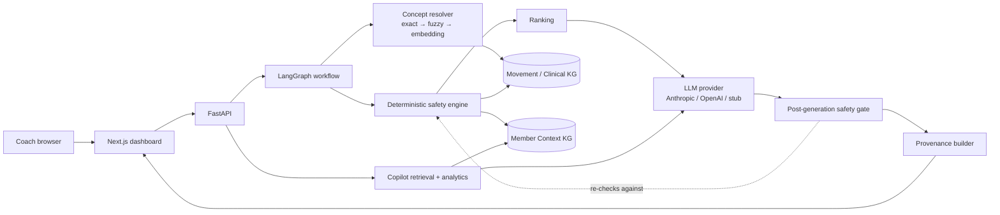

# Future Coach Intelligence Platform

A coach-facing dashboard with two surfaces — an **AI workout generator** and a
**member-context copilot** — built on two knowledge graphs.

The premise the whole system is organized around:

> **The knowledge graph owns exercise safety. The LLM does not.**

Safety constraints are derived by deterministic graph traversal *before* the
model is invoked, and every exercise the model returns is re-checked against
those same decisions *afterwards*. Safety is therefore a system invariant, not a
prompt instruction that a model might or might not honor.


The two knowledge graphs:


---

## Contents

- [What it does](#what-it-does)
- [Quick start](#quick-start)
- [Architecture](#architecture)
- [Why a knowledge graph is required](#why-a-knowledge-graph-is-required)
- [The two knowledge graphs](#the-two-knowledge-graphs)
- [Ontology decisions](#ontology-decisions)
- [Concept resolution](#concept-resolution)
- [Deterministic safety engine](#deterministic-safety-engine)
- [Agentic workflow](#agentic-workflow)
- [Post-generation safety gate](#post-generation-safety-gate)
- [Provenance](#provenance)
- [Coach AI copilot](#coach-ai-copilot)
- [What the supplied data actually contains](#what-the-supplied-data-actually-contains)
- [Demo scenarios](#demo-scenarios)
- [Tests](#tests)
- [Technology choices](#technology-choices)
- [Observability](#observability)
- [Evaluating this in production](#evaluating-this-in-production)
- [Trade-offs and deliberate decisions](#trade-offs-and-deliberate-decisions)
- [Known limitations](#known-limitations)
- [How AI was used to build this](#how-ai-was-used-to-build-this)

---

## What it does

**Workout generator.** A coach types a request and a duration:

> *"Create a 45-minute lower-body workout. Her left knee is bothering her and she
> only has dumbbells and a kettlebell."*

The system resolves the messy language onto canonical graph concepts, walks the
anatomy hierarchy to find what the injury actually implicates, filters the
catalog by equipment and explicit exclusions, ranks what survives, lets the LLM
compose a plan **only from approved candidates**, re-validates the result, and
returns the plan with a full provenance trace of what was filtered and why.

**Coach copilot.** A chat panel that answers member questions — the brief,
adherence trend, sleep, what changed, churn risk — by querying the member graph
and computing the numbers in Python, then asking the LLM only to phrase them.

---

## Live demo

| | |
|---|---|
| Dashboard | https://future-coach-frontend.onrender.com |
| API docs | https://future-coach-backend.onrender.com/docs |

Two caveats worth knowing before you click:

- **Free tier cold starts.** Both services spin down when idle, so the first
  request can take 30-60s. Subsequent requests are fast (~13 ms end to end).
- **The deployment runs the in-memory graph backend, not Neo4j.** Render has no
  managed Neo4j, and the in-memory backend runs the *identical* traversals
  behind the same `GraphRepository` Protocol - verified to produce
  byte-identical filtering counts on both. To browse the graph itself, run
  `docker compose up` locally and open the Neo4j browser.

Deployment config lives in [`render.yaml`](render.yaml). The frontend sets a
relative `NEXT_PUBLIC_API_BASE=/api` and proxies to `BACKEND_ORIGIN` through a
Next rewrite, so the browser only ever talks to one origin and CORS never
applies.

---

## Quick start

Requires Python 3.11+ and Node 20+.

```bash
cp .env.example .env      # every default works; no API key needed
make setup                # install backend + frontend dependencies
make dev                  # backend :8000, frontend :3000
```

Open <http://localhost:3000>.

**It runs with no secrets and no database.** The default configuration uses an
in-memory graph backend and a deterministic offline LLM stub, so a reviewer can
see the graph reasoning, the safety gate and the provenance trace immediately.

For the full stack including Neo4j (recommended — you can browse the graph at
<http://localhost:7474>):

```bash
docker compose up --build
```

Or point the local backend at Neo4j only:

```bash
docker compose up -d neo4j
GRAPH_BACKEND=neo4j python scripts/seed_graph.py    # seeds from a clean state
GRAPH_BACKEND=neo4j make dev-backend
```

To use a real model, set `LLM_PROVIDER=anthropic` (or `openai`) and the matching
API key in `.env`. Nothing about safety changes when you do — that is the point.

| Command | What it does |
|---|---|
| `make dev` | Run backend and frontend together |
| `make seed` | Seed + verify the graph from a clean state |
| `make test` | Backend test suite |
| `make verify` | Tests, lint, typecheck, production build, demo scenarios |

---

## Architecture



The load-bearing detail is the dotted line: the gate re-checks the model's output
against the *same* decisions that produced the candidate list.

```
backend/app/
├── domain/        typed contracts (exercise, member, workout, safety, resolution)
├── ontology/      curated anatomy + SKOS mappings (mappings.yaml, loader.py)
├── graph/         model.py, repository.py (Protocol), memory_repository.py,
│                  neo4j_repository.py, queries.py (Cypher)
├── ingestion/     exercises.py (KG1), member.py (KG2)
├── resolution/    normalizer.py, resolver.py, embeddings.py
├── safety/        engine.py, policies.py, ranking.py, validator.py  ← the gate
├── agents/        intent.py, workout_graph.py (LangGraph), workout_planner.py
├── provenance/    builder.py
├── copilot/       service.py, analytics.py
└── api/           routes.py, schemas.py, deps.py
```

---

## Why a knowledge graph is required

The clearest argument is in the supplied data itself.

**1. The injury does not match the catalog's vocabulary.** Jordan's injury is
recorded as *patellofemoral pain*. The exercise catalog never uses that term — it
annotates exercises at the granularity of `knee`. A system matching strings, or
embedding similarity, has to get lucky. The graph states the relationship
explicitly and walks it:

```
Jordan → HAS_INJURY → Left Knee (recovering) → MAPS_TO → Patellofemoral Pain Syndrome
                                                       → AFFECTS → Patellofemoral Joint
                                                                 → PART_OF → Knee
Goblet Split Squat → STRESSES → Knee
```

**2. "Exclude deadlifts" matches nothing by name.** There is **no exercise in the
50-row catalog whose name contains "deadlift"**. A string filter would silently
remove zero exercises and the coach would never know their instruction was
ignored. The graph resolves the phrase to the hinge movement family and removes
its members:

```
"deadlifts" → movement_family:hinge → lower pull - hip lift
            → One-Kettlebell Hamstring Walkout, Med Ball Hamstring Walkout
```

**3. Safety needs to be auditable and reproducible.** A traversal is testable,
deterministic, and can be shown to a coach as evidence. A model's judgement about
whether a squat is safe for an irritated patellofemoral joint is none of those
things.

Embeddings still earn a place — but only as the third pass of *concept
resolution*, never as the safety mechanism.

---

## The two knowledge graphs

Kept conceptually separate and joined at ingest time through shared canonical
concepts.

### KG1 · Movement / Clinical domain

| Nodes | Edges |
|---|---|
| `Exercise` (50) | `TARGETS` → Muscle |
| `Muscle` (19) | `STRESSES` → AnatomicalRegion |
| `AnatomicalRegion` (14) | `REQUIRES` → Equipment |
| `MovementPattern` (36) | `HAS_PATTERN` → MovementPattern |
| `MovementFamily` (9) | `IN_FAMILY` (pattern → family) |
| `Equipment` (32) | `PART_OF` (anatomy hierarchy) |
| `InjuryCondition` (3) | `AFFECTS` (condition → region) |
| `OntologyConcept` (11) | `CONTRAINDICATES` (condition → pattern) |
| | `SKOS_EXACT_MATCH` / `SKOS_CLOSE_MATCH` |

The 14 anatomical regions are the 9 catalog joints plus a deliberately small
curated hierarchy that gives the injury reasoning somewhere to walk:

```
Patellofemoral Joint ─┐
Tibiofemoral Joint  ──┴→ Knee → Lower Limb
Lumbar Spine ─┐
Thoracic Spine ┼→ Spine
Cervical Spine ┘
```

### KG2 · Member context

`Member`, `Goal`, `Preference`, `Injury`, `Equipment`, `WorkoutSession`,
`ExercisePerformance`, `AdherenceObservation`, `BiomarkerObservation`,
`LabResult`, `DEXAResult`, `ChatMessage`, `CoachBrief`, `ChurnSignal`.

Longitudinal observations are **individual timestamped nodes**, not collapsed
into member properties — 4 adherence weeks, 7 sleep nights and 3 weight readings
each get their own node so the copilot can run real queries over them.

### Where they join

```
Member -HAS_INJURY→ Injury -MAPS_TO→ InjuryCondition -AFFECTS→ AnatomicalRegion
Member -HAS_EQUIPMENT→ Equipment   (the same Equipment nodes KG1 uses)
```

---

## Ontology decisions

The brief asks for reasoning about *what to pull and what to leave out*. The
stance taken here: **a small, semantically correct subset used meaningfully beats
a wide shallow integration.**

**What was used**

| Ontology | Used for | Extent |
|---|---|---|
| **SNOMED CT** | Anatomy and clinical conditions | 8 concepts with codes, as explicit `OntologyConcept` nodes with SKOS mapping edges |
| **SKOS** | Mapping predicates | `skos:exactMatch` where the local concept denotes the same thing, `skos:closeMatch` where ours is a coarser product-level grouping |
| **PROV-O** | Provenance semantics | Applied conceptually — each decision records what was generated, the activity that produced it (`knowledge_graph` / `llm_composition` / `post_validation`), and what it derived from (the traversed paths). No RDF stack. |
| **OPE / COPPER** | Reviewed, not ingested | See below |

**What was deliberately left out, and why**

- **Full OWL ingestion of any ontology.** Thousands of unused concepts would add
  no reasoning capability to a 50-exercise catalog and would obscure the parts
  doing real work.
- **OPE and COPPER as data.** They informed how exercises, equipment and
  personalisation concepts are modelled, but the catalog's own taxonomy is already
  the operative vocabulary. Mapping 50 exercises to OPE identifiers I could not
  verify would be decoration.

**On not inventing identifiers.** Every SNOMED code in
[`backend/app/ontology/mappings.yaml`](backend/app/ontology/mappings.yaml) is
marked `status: verified` or carries no code at all. The patellofemoral *joint
structure* concept is a case in point: the local canonical concept is retained,
`status: unverified` is recorded, and **no code is fabricated**. Production would
resolve these against a licensed terminology server (NCI EVS). Unverified
mappings stay as node properties and never become `OntologyConcept` nodes, so the
graph never asserts an external identity it cannot support.

---

## Concept resolution

Three passes with explicit thresholds, in
[`backend/app/resolution/resolver.py`](backend/app/resolution/resolver.py):

```
normalize → exact/alias → fuzzy (RapidFuzz) → embedding (cosine) → threshold → unresolved
```

| Pass | Confidence | Accept at |
|---|---|---|
| Exact label | 1.00 | always |
| Curated alias | 0.98 | always |
| Fuzzy (WRatio) | computed | ≥ 0.88 |
| Embedding (cosine) | computed | ≥ 0.82 |
| Below threshold | — | **unresolved** |

Every result carries source text, canonical id, type, method and confidence, and
the UI renders them as badges so a coach can see how their words were understood.

**The specificity guard.** RapidFuzz's partial matching scored
`"weird knee-ish thing"` at 0.90 against the alias `knee` — high enough to apply a
*clinical* safety rule the coach never asked for. Confidence is therefore scaled
by how much of the query the matched alias actually accounts for; short phrases
("no barbell") are exempt so ordinary coach shorthand is unaffected. That phrase
now correctly resolves to nothing.

**Failing gracefully matters more than coverage.** Below threshold we return
`unresolved` with the near-miss recorded for transparency, and the UI shows it as
*"unresolved — not guessed"*. Forcing a low-confidence match on clinical language
is how a system silently applies the wrong safety rule.

**Embeddings are deliberately not a neural model.** The default is a
deterministic character n-gram TF-IDF vector with cosine similarity. It needs no
download, no key and no network, so `make dev` and the test suite work anywhere,
and the embedding pass can be unit-tested with exact expected scores instead of
being a black box. `EmbeddingBackend` is a Protocol — swapping in
sentence-transformers or a provider embeddings API is a one-class change. What
must not change is that embeddings only canonicalise language and never decide
safety.

---

## Deterministic safety engine

[`backend/app/safety/engine.py`](backend/app/safety/engine.py) produces a
`SafetyDecision` for **all 50 exercises** on every request. Each decision carries
`status`, `reasons` (with rule ids), `graph_paths` and `score_adjustment`.

| Rule | Behaviour |
|---|---|
| **A · Explicit exclusion** | Resolve the phrase → movement family → patterns → exercises. Also handles equipment bans ("no barbell"). |
| **B · Injury anatomy** | Injury → condition → region → `PART_OF` closure (**both directions**) → exercises with a `STRESSES` edge into it. |
| **C · Contraindication** | Explicit `CONTRAINDICATES` edges from the condition to movement patterns, derived from the member's own clinical note. |
| **D · Equipment** | An exercise is eligible only if *every* required item is available. |
| **E · Preferences** | Adjust ranking only. **Never** produce an exclusion. |

**Why the closure walks upward.** Descendants matter in general (an injury to
"knee" implicates its sub-structures), but for *this* dataset the ancestor walk is
what does the work: the injury sits at the patellofemoral joint while the catalog
annotates exercises at `knee`. Without it, the knee injury would match nothing.

**Severity policy.** Jordan is `mild` / `recovering` and explicitly *"cleared for
low-impact loading"*. So:

- **Plyometrics are hard-excluded** — the clinical note says "avoid ...
  plyometrics", and impact loading on an irritated joint is categorically unsafe.
- **Loaded deep-flexion patterns** (squat, split squat, lunge) are **down-ranked
  with a range-of-motion caveat**, not removed. Removing them would contradict the
  clinical note and leave almost nothing trainable. An `acute` or `moderate`
  injury flips this to a hard exclusion — see
  [`policies.py`](backend/app/safety/policies.py).

**Side-aware reasoning.** This fell out of reading the data properly. The catalog
marks unilateral variants with `side: left_leg` / `left_arm` / `left_side`, and
Jordan's injury is her **left** knee. A `left_leg` variant loading the knee is
loading the *injured limb specifically*, so it takes an additional penalty that a
bilateral variant does not.

**Missing data is not treated as safe.** Two catalog rows have an empty
`joints_loaded`. They cannot be certified against an injury, so they are flagged
`unknown_anatomy` and down-ranked rather than assumed fine.

---

## Agentic workflow

LangGraph, in
[`backend/app/agents/workout_graph.py`](backend/app/agents/workout_graph.py):

```
load_member → parse_intent(+resolve) → evaluate_safety → rank_candidates
            → compose_workout (LLM) → validate_workout → build_provenance
```

Only `compose_workout` touches the LLM. The rest are ordinary deterministic
functions, modelled as explicit nodes so the execution graph shows exactly where
generative work happens — and, more usefully, where it does not. Nothing is
dressed up as an "agent" for its own sake; `resolve_concepts` shares a node with
`parse_intent` because intent parsing already routes every span through the
resolver, and a separate node would be theatre.

The model receives only: member goals and preferences, duration, resolved intent,
and the **safe candidate ids**. It never sees the filtered exercises, so it cannot
select one.

---

## Post-generation safety gate

The single most important module:
[`backend/app/safety/validator.py`](backend/app/safety/validator.py).

Whatever the model returns, every exercise id is re-checked against the
deterministic decisions:

1. **Excluded exercise selected** → rejected, replaced from the ranked safe pool.
2. **Hallucinated id** → rejected; an unknown id can never be certified safe.
3. **Nothing survives** → `UnsafePlanError`, and the API returns 422. Fails closed.

Every correction is recorded and surfaced in the UI — a silent fix would hide
exactly the event a reviewer most wants to see.

This is proven by driving the **real workflow** with an adversarial LLM client
that ignores the candidate list
([`tests/test_post_validation.py`](backend/tests/test_post_validation.py)),
including a test that feeds it *every* excluded exercise at once:

```python
async def test_workflow_sanitizes_a_jailbroken_plan(...):
    workflow = WorkoutWorkflow(repository, ontology, resolver, engine, AdversarialLLM(banned))
    state = await workflow.run(WorkoutRequest(...))

    assert not planned & {exercise_id for exercise_id, _ in banned}
    assert report.passed is False
    assert "hallucinated-id-9000" in report.hallucinated_ids
```

---

## Provenance

Built from deterministic evidence only — the graph paths and rule ids the safety
engine already produced. The LLM is never asked to invent a justification,
because a fluent explanation of a decision the system did not make is worse than
no explanation.

For a filtered exercise the inspector shows the reason, the traversal, and the
decision source:

```
Barbell Racked Forward Lunge                                    FILTERED

Requires Barbell, which Jordan Rivera does not have.
  Barbell Racked Forward Lunge ─REQUIRES→ Barbell
  Jordan Rivera ─DOES_NOT_HAVE→ Barbell

Patellofemoral Pain Syndrome contraindicates 'lower push - lunge'.
  Patellofemoral Pain Syndrome ─CONTRAINDICATES→ lower push - lunge ─HAS_PATTERN→ …
  Jordan Rivera ─HAS_INJURY→ Left Knee ─MAPS_TO→ Patellofemoral Pain Syndrome
                ─AFFECTS→ Patellofemoral Joint

Decision source   ✓ Knowledge graph    ✕ LLM did not decide safety
```

---

## Coach AI copilot

Retrieval order is strict:

```
classify intent → query the member graph for that slice → compute analytics in Python
                → hand compact evidence to the LLM → grounded answer + chart payload
```

Supported intents: `SHOW_BRIEF`, `ADHERENCE_TREND`, `SLEEP_WEEK`, `WHAT_CHANGED`,
`CHURN_RISK`, `MESSAGE_PATTERN`, `WORKOUT_HISTORY`, `LABS`, `GENERAL_MEMBER_QA`.

**The member JSON is never dumped into a prompt.** Each intent retrieves only its
slice, which keeps tokens low and — more importantly — means the model cannot
"answer" from data the coach did not ask about. A test asserts that an adherence
question's evidence contains no labs, chat or workout history.

**Numbers are computed, never generated.** Trends, deltas and averages are
arithmetic in [`analytics.py`](backend/app/copilot/analytics.py). Charts render a
payload built in Python, so what is plotted is exactly what the graph holds.

**Missing data produces an admission.** With labs removed, the copilot answers
*"No lab results for Jordan"* and returns `generator: "deterministic"` — the LLM is
not called at all, so it cannot improvise.

---

## MCP interface layer

The AI-facing surface is an **MCP server mounted on the same FastAPI app** at
`/mcp`, using the official Python SDK over Streamable HTTP.

It is an *adapter*, not a second implementation. Both interfaces converge:

```
Human UI  ──► FastAPI REST  ──┐
                              ├──► resolver · safety engine · graph repository
AI client ──► MCP  /mcp     ──┘         (one Services container)
```

Mounting rather than running a sibling process is the load-bearing choice: it
guarantees both interfaces observe the *same* process-local services, so a
safety decision cannot differ depending on which interface asked.

### Tools

| Tool | Delegates to | Notes |
|---|---|---|
| `get_member_context` | `GraphRepository` + `copilot.analytics` | Curated projection. Absent data stays `null` rather than being zero-filled. |
| `resolve_coach_concepts` | `agents.intent.parse_intent` → `ConceptResolver` | Same entry point the pipeline uses, so the tool cannot disagree with what the engine receives. Reports unresolved phrases instead of guessing. |
| `get_member_metric_trend` | `copilot.analytics` | Adherence / sleep / weight. Arithmetic in Python; `<2` observations is `insufficient_data`; an unknown metric errors rather than returning empty. |
| `evaluate_exercise_safety` | `SafetyEngine.evaluate` | **Authoritative.** Parity with a direct engine call is asserted across the whole catalog. |
| `get_exercise_provenance` | `SafetyEngine` + `GraphPath` | Real ordered nodes/relationships/directions. Where a rule is a set operation, `has_graph_path` is `false` — no path is invented. |
| `get_safe_exercise_candidates` | `ConceptResolver` → `SafetyEngine` → `rank_candidates` | `limit` applied **after** filtering and ranking. Excluded exercises can never appear. |
| `evaluate_workout_request` | `SafetyEngine` → `rank_candidates` → provenance | **Read-only.** Runs the deterministic pre-generation pipeline and stops. |

### The Copilot is an MCP client

```
coach question → deterministic tool plan → real MCP client session
              → MCP server → same services → authoritative result
              → LLM phrases it → SafetyVerdictGuard checks it
```

The Copilot never imports `app.mcp.tools`; it goes through `tools/list` and
`tools/call` over an in-process transport, so discovery, JSON Schema validation,
structured results and protocol errors are all genuinely exercised. External
clients reach the identical server over Streamable HTTP.

Three properties are enforced in code, not by prompt:

- **Bounded loop.** Plans are built up-front and capped at `MAX_TOOL_CALLS` (4).
- **Safety cannot be talked around.** `SafetyVerdictGuard` compares the generated
  prose against the returned verdicts; if the graph said *excluded* and the
  sentence says *safe*, the sentence is replaced. A prompt reduces that risk, a
  check removes it.
- **Failure is closed.** If MCP is unreachable the Copilot falls back to the
  original deterministic dispatcher — which calls the *same* domain services —
  never to free-form model judgement.

Responses carry optional `grounding` metadata (`mode`, `tools_used`,
`authoritative_safety`), surfaced in the UI as a subtle **MCP grounded** chip
with a collapsed tool list. Raw MCP payloads are not shown to the coach.

`evaluate_workout_request` deliberately never composes a plan — `composed_workout`
is always `null`. It answers *"would this be safe"*, *"what constraints apply"*,
*"what is eligible"* and *"why was X removed"* from the authoritative decisions,
while LLM composition stays solely behind `POST /api/workouts/generate`.

### What the MCP layer must never do

No rule evaluation, no traversal, no thresholds, no direct Cypher. Every tool
delegates. The invariant is unchanged by adding an AI interface:

> **Knowledge graph = safety authority. LLM = tool selection, composition and
> explanation.**

### Two implementation notes worth knowing

**Starlette's `Mount` does not run a sub-application's lifespan.** Mounting the
MCP app alone produces a server that imports, starts and serves REST traffic
perfectly, then fails on the first MCP request with *"Task group is not
initialized"*. The session manager is therefore started from the host lifespan
(`mcp_session_lifespan`). Only an HTTP round-trip catches this, so there is a
regression test that drives one.

**DNS-rebinding protection is on.** The transport validates the `Host` header and
answers `421` to anything unlisted. Since this server exposes member health data
that protection stays enabled and the allow-list is configured instead
(`MCP_ALLOWED_HOSTS`). A new deployment must add its public hostname.

---

## What the supplied data actually contains

Reading the data changed several design decisions. Recording it here because
these are the details that would otherwise become silent bugs.

| Finding | Consequence |
|---|---|
| **No exercise is named "deadlift"** | Exclusion must resolve to a movement family. A string filter removes nothing. |
| **`priority_tier` is `2` for all 50 rows** | It carries zero ranking signal. Preserved for fidelity, never ranked on; ranking uses goal alignment, focus, equipment fit and recency instead. |
| **`is_bilateral: true` means *unilateral*** | It marks exercises performed one side at a time (all 18 such rows have a non-null `side`). Exposed as `is_unilateral`; the raw field is kept. |
| **`side` is only ever `left_*`** | The right-hand twins are outside this 50-row slice. Combined with a **left** knee injury, this enables side-aware safety. |
| **All 18 `bilateral_pair_id` values are dangling** | Recorded as a property; a `BILATERAL_PAIR` edge is created only when the target exists. Never crashes. |
| **2 rows have empty `joints_loaded`** | Flagged `unknown_anatomy` and down-ranked — cannot be certified safe. |
| **1 row lists `shoulder` twice** | Joint lists de-duplicated on ingest. |
| **`sleep_hours_last_7_days` has no dates** | Anchored to the coach-brief date and stored with `date_inferred: true`, so the UI never implies more precision than the data has. |
| **Workout history stores display names** | e.g. "KB Romanian Deadlift" is not in the catalog. Linked only on a confident normalized match; the rest stay unresolved rather than being guessed. |
| **Member equipment strings match the catalog exactly** | No fuzzy join needed for availability. |
| **Only 21 of 50 exercises are feasible with her equipment** | The safe pool is genuinely small; the system reports this rather than padding the plan. |

---

## Demo scenarios

`python scripts/demo_scenarios.py` runs all three end-to-end and asserts the
outcomes. Executable documentation — it fails loudly if behaviour drifts.

### 1 · Injury

> *"Create a 45-minute lower-body workout. Her left knee is bothering her."*

```
resolved : '45-minute lower-body' → focus:lower_body (fuzzy)
           'left knee'            → anatomy:knee (alias)
eligible=18  excluded=32  downranked=8  in_plan=9

Static Jump, Vertical Jump to Broad Jump   FILTERED
  → Patellofemoral Pain Syndrome ─CONTRAINDICATES→ cardio - plyometric
Dumbbell Goblet Split Squat                DOWN-RANKED (−115)
  → stresses Knee (inside the injured closure), and its left_leg variant
    loads the injured side
```

### 2 · Limited equipment

> *"Build a full-body workout. She has no barbell, only dumbbells and a kettlebell."*

```
resolved : 'barbell' → equipment:barbell (exact, EXCLUDED by "no")
           'dumbbells' → equipment:dumbbell, 'kettlebell' → equipment:kettlebell
eligible=16  excluded=34  in_plan=9

All 3 barbell exercises and every machine exercise FILTERED.
Dumbbell/kettlebell alternatives remain and are selected.
```

Note the clause-scoped parsing: `"no barbell, only dumbbells and a kettlebell"`
excludes the barbell **without** the negation leaking onto the kettlebell — a bug
this earlier had, now covered by a regression test.

### 3 · Explicit exclusion

> *"Create a lower-body workout but exclude deadlifts."*

```
resolved : 'deadlifts' → movement_family:hinge (alias)
eligible=17  excluded=33  in_plan=9

One-Kettlebell Hamstring Walkout, Med Ball Hamstring Walkout   FILTERED
  → …─HAS_PATTERN→ lower pull - hip lift ─IN_FAMILY→ Hip Hinge / Deadlift Family
```

The hamstring walkout appears in Scenario 1's plan and disappears in Scenario 3 —
visible proof the exclusion reached the right exercises through the graph.

---

## Tests

**114 tests, all passing**, deliberately concentrated on the paths where a bug
produces a *confidently wrong* answer rather than a visible failure.

```
tests/test_resolver.py          43   normalization, exact/alias, fuzzy typos,
                                     embedding fallback, thresholds, unresolved
tests/test_safety.py            36   anatomy closure, contraindications, equipment,
                                     exclusions, preferences-never-override-safety
tests/test_post_validation.py   13   the safety gate, incl. adversarial end-to-end
tests/test_copilot.py           22   grounding, missing data, chart correctness
```

Everything runs against the in-memory graph — no Docker, database, network or API
key — so the highest-risk module is testable on every commit.

Notable cases:

- `test_closure_reaches_the_parent_joint` — the traversal the whole design rests on.
- `test_no_exercise_is_literally_named_deadlift` — guards the premise of the
  exclusion test, so it fails loudly if the dataset ever changes.
- `test_preference_alone_never_produces_exclusion` — the dislike/contraindication
  boundary.
- `test_near_threshold_typo_is_rejected_not_rounded_up` — 0.875 must not squeak
  past a 0.88 gate.
- `test_workflow_sanitizes_a_jailbroken_plan` — the invariant, end to end.

---

## Technology choices

| Choice | Why |
|---|---|
| **Neo4j** | Traversal is the core of the assignment. Cypher makes the safety logic reviewable as queries, and the browser lets a reviewer *see* the anatomy hierarchy. |
| **In-memory backend behind the same Protocol** | Zero-setup DX and fast tests. Both implement `GraphRepository`, so safety logic is identical. Verified: both backends produce byte-identical counts across all three scenarios (18/32/8, 16/34/7, 17/33/7). |
| **FastAPI + Pydantic v2** | Typed contracts that generate the OpenAPI schema, natural async for graph + LLM calls, concise for a time-boxed build. |
| **LangGraph** | An explicit execution graph that shows where the LLM participates. Kept small on purpose. |
| **Next.js + TanStack Query + Recharts** | Fast to build a polished dashboard; charts render deterministic payloads. No business-critical safety logic lives in the frontend. |
| **RapidFuzz** | Fast, well-tested fuzzy matching with tunable scorers. |
| **Provider abstraction** | `LLMClient` Protocol with Anthropic, OpenAI and stub implementations. The architecture is not wired to one vendor. |
| **MCP (official Python SDK)** | An AI-facing interface layer over the *same* services the REST API uses. It is an adapter, not a second implementation — no safety logic lives in it. |

### Dependency note — why FastAPI was raised to 0.116.2

Adding MCP forced a FastAPI floor, and it is worth stating plainly because it is a
real constraint rather than a version-chasing preference.

On Python 3.14 the MCP SDK requires `starlette>=0.48`. FastAPI up to and including
`0.116.0` pinned `starlette<0.47`. Those ranges do not intersect, so **no version of
the MCP SDK can be installed alongside FastAPI ≤0.116.0 on this interpreter** — the
result is an unimportable app (`Router.__init__() got an unexpected keyword argument
'on_startup'`), not merely a pip warning.

`0.116.2` is the *earliest* release whose starlette range (`<0.49`) admits `0.48`, so
it is the true minimum rather than a jump to latest. It was verified empirically, not
inferred: at that exact floor the MCP ASGI app mounts and a tool round-trip completes.

A clean `pip install -e "backend[dev]"` resolves to the newest compatible set
(FastAPI 0.141, starlette 1.6, LangGraph 1.2, Neo4j driver 6.2). All 135 tests and all
three demo scenarios pass on both that resolution and the 0.116.2 floor.

---

## Observability

Each workout request logs a single structured line:

```
request_id=c805746c855f member=mbr_01HX9JORDAN resolved=4 unresolved=0
eligible=18 excluded=32 in_plan=9 rejections=0 total_ms=38.7
```

Per-node timings are returned in the API response and rendered as a breakdown in
the provenance inspector. A typical end-to-end request with the stub is **~39 ms**;
with a real provider, latency is dominated by the single composition call. Secrets
are never logged, and provider errors log the status code only — never the request
body, which contains member context.

---

## Evaluating this in production

**Safety** — the metric that matters most is binary and should be zero:

```
unsafe exercise survives deterministic post-validation = 0
```

Alongside it: graph-filter escape rate, false-positive filter rate (over-filtering
makes the product useless in a different way), unresolved clinical concept rate,
and coach override rate — a coach re-adding a filtered exercise is the strongest
signal a policy is wrong.

**Recommendation quality** — coach acceptance rate, exercise replacement rate,
plan regeneration rate, workout completion, adherence after recommendation,
diversity vs repetition, goal alignment.

**Resolver** — precision/recall per pass against a labelled corpus of real coach
phrasings, false-canonicalisation rate (the dangerous one), unresolved rate, and
threshold sensitivity curves. The thresholds here were calibrated against tests,
not chosen by intuition, and would be re-calibrated on real data.

**Copilot** — factual grounding accuracy, unsupported-claim rate, chart
correctness, retrieval relevance, and coach task-completion time.

**Coverage** — graph coverage monitoring: exercises with no anatomy data, injuries
that fail to map to a condition, ontology terms with unverified mappings.

---

## Trade-offs and deliberate decisions

- **Curated ontology subset over full ingestion.** Justified above. The main cost
  is that adding a new condition means editing YAML rather than importing a
  release.
- **Down-rank vs exclude for a recovering injury.** Excluding every knee-loading
  pattern would leave Jordan almost nothing to train and would contradict her
  clinical note. Down-ranking with a ROM caveat is the defensible middle, and the
  policy flips to hard exclusion for acute/moderate injuries. This is the decision
  I would most want a clinician to review.
- **Deterministic embedder over a neural model.** Testability and zero-setup DX
  beat marginal recall at this scale. The interface makes it swappable.
- **Stub LLM as the default.** A reviewer sees the architecture work immediately
  without a key. Every response is tagged `generator: "stub"` so it never
  masquerades as model output.
- **`GraphRepository` Protocol over direct driver use.** Costs one indirection;
  buys unit-testable safety logic and two interchangeable backends.
- **Hand-written frontend types.** The API surface is small and explicit types are
  clearer in review; the cost is that a backend schema change is caught by tests
  rather than by `tsc`.
- **Mock auth.** Out of scope for the assessment; a single synthetic member.

---

## Known limitations

This is an assessment prototype, not a production system. Specifically:

- **Single member.** The API is parameterised by `member_id`, but only one
  synthetic member exists and a one-member dataset resolves any id.
- **No auth, no tenancy, no rate limiting, no audit persistence.** Provenance is
  computed per request and returned, not stored.
- **The clinical policy is mine, not a clinician's.** The contraindication sets
  and severity thresholds are reasonable readings of the member's own notes, and
  would need clinical review before anyone trained on them.
- **Ontology grounding is partial.** 8 verified SNOMED concepts; OPE and COPPER
  informed the modelling but are not ingested.
- **Duration budgeting is approximate.** Section sizes scale with duration but the
  system does not solve a true time budget from `estimated_rep_duration`.
- **The embedding pass is lexical.** It catches morphological variants, not
  semantic paraphrase ("her kneecap grinds" would not resolve).
- **No streaming**, no graph visualisation in-app (the Neo4j browser covers it),
  and no evaluation harness beyond the test suite.
- **Backend/frontend contract is not codegen-verified.**

---

## How AI was used to build this

AI coding assistance (Claude) was used substantially throughout: scaffolding
modules, drafting the test suites, writing documentation, and iterating on the
frontend.

What was directed and verified by me rather than accepted from a model:

- **The architecture** — the two-graph split, the `GraphRepository` boundary, and
  the decision to run the safety engine twice with the gate in between.
- **The data analysis.** Every finding in
  [What the supplied data actually contains](#what-the-supplied-data-actually-contains)
  came from querying the files directly before writing ingestion code. Several
  contradict reasonable assumptions — the absent deadlifts, the inverted
  `is_bilateral`, the uniform `priority_tier` — and each was verified against the
  data rather than assumed.
- **The graph semantics and safety policy** — which edges exist, which direction
  the closure walks, and what gets excluded vs down-ranked.
- **The bugs worth catching.** Three real defects surfaced during integration and
  were fixed rather than papered over: the resolver confidently mapping
  `"weird knee-ish thing"` to `knee`; the intent parser bucketing
  `"exclude deadlifts"` as a *focus* so Scenario 3 silently excluded nothing; and
  negation leaking across clauses so `"no barbell, only dumbbells and a kettlebell"`
  removed the kettlebell. Each now has a regression test.
- **Ontology honesty** — refusing to emit a SNOMED code I could not verify.

---

## Data

Only the Future-provided synthetic data in [`data/`](data/) is used —
`exercises.json` (50 exercises) and `member-context.json` (Jordan Rivera). No real
member data, and no additional synthetic members were generated. `.env` is
gitignored and no secrets are committed.
