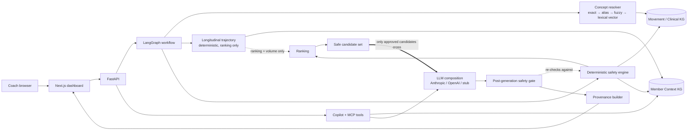
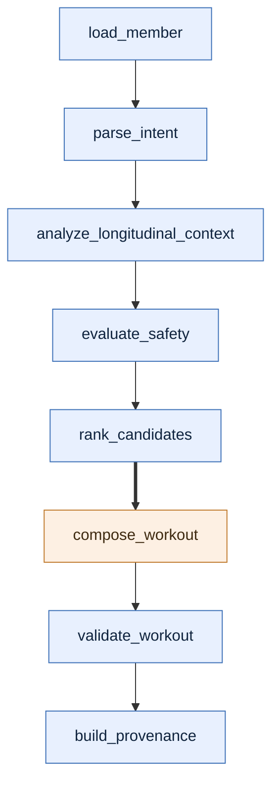

# Future Coach AI — Knowledge-Graph Backed Workout Intelligence

A coach-facing system that generates personalized workouts and answers
member-specific questions, while keeping every safety decision deterministic and
auditable. A coach types *"45-minute lower body, her left knee is bothering her,
she only has dumbbells and a kettlebell"*; the system resolves that language onto
canonical graph concepts, walks the anatomy hierarchy to find what the injury
actually implicates, filters the catalog, ranks what survives, lets an LLM
compose a plan **only from graph-approved candidates**, re-validates the result,
and returns it with a provenance trace of what was excluded and which rule did
it.

> ### The graph decides safety; the LLM composes only from graph-approved candidates.
>
> Safety constraints are derived by graph traversal *before* the model is
> invoked, and every exercise the model returns is re-checked against those same
> decisions *afterwards*. Safety is a system invariant, not a prompt instruction
> a model might or might not honor.

## Live demo

| Surface | URL | Purpose |
|---|---|---|
| **Coach Dashboard** | [future-coach-frontend.onrender.com](https://future-coach-frontend.onrender.com) | Generate and adjust workouts; ask the Coach Copilot |
| **Knowledge Graph Explorer** | [`/graph`](https://future-coach-frontend.onrender.com/graph) | Inspect the real graph, ontology mappings and safety paths |
| **System Quality** | [`/system`](https://future-coach-frontend.onrender.com/system) | Evaluation results, invariants, execution traces, MCP observability |
| **REST API** | [future-coach-backend.onrender.com](https://future-coach-backend.onrender.com) | Typed application APIs ([`/docs`](https://future-coach-backend.onrender.com/docs)) |
| **MCP Server** | [`/mcp/`](https://future-coach-backend.onrender.com/mcp/) | Seven read-only AI tools over the same domain services |

> **Neo4j intentionally has no public URL.** It runs as a private Render service
> reachable only by the backend over Render's private network, with `/data` on a
> persistent disk. There is no public Bolt endpoint, no public Neo4j Browser, and
> no Neo4j credential anywhere in the browser bundle. `/graph` is the browsing
> surface, and it is read-only and privacy-filtered.

The deployed backend runs `GRAPH_BACKEND=neo4j` against that private instance —
`/health/ready` reports it, so the claim is checkable rather than asserted. The
frontend is on Render's free tier and spins down when idle, so the **first** page
load after a quiet period can take 30–60s; the backend does not spin down.

## Current quality gate

| Measure | Result |
|---|---|
| Evaluation corpus | **71 / 71 cases passing**, 8 categories |
| Unsafe validation escapes | **0** — a graph-excluded exercise surviving final validation |
| System invariants | **12 / 12**, each proven by executed cases |
| Ontology mappings | **29 verified** SNOMED CT concepts, re-resolvable against NCI EVS |
| MCP tools | **7**, read-only |
| Deployed graph | **237 nodes / 529 edges** in Neo4j |
| Backend tests | **502 passing**, green on *both* graph backends |
| Frontend tests | **187 passing** |

Memory/Neo4j parity and deployed/local parity are both asserted, not assumed:
the same 71 cases and the same demo scenarios produce identical decisions on
either backend. These are deterministic regression gates over the scenarios they
cover — not a proof of universal safety.


---

## Contents

- [What to try](#what-to-try)
- [What it does](#what-it-does)
- [Quick start](#quick-start)
- [Architecture](#architecture)
- [Why a knowledge graph is required](#why-a-knowledge-graph-is-required)
- [The two knowledge graphs](#the-two-knowledge-graphs)
- [Ontology decisions](#ontology-decisions)
- [Concept resolution](#concept-resolution)
- [Deterministic safety engine](#deterministic-safety-engine)
- [Longitudinal reasoning](#longitudinal-reasoning)
- [Interactive workout adjustment](#interactive-workout-adjustment)
- [Agentic workflow](#agentic-workflow)
- [Post-generation safety gate](#post-generation-safety-gate)
- [Provenance](#provenance)
- [Coach AI copilot](#coach-ai-copilot)
- [What the supplied data actually contains](#what-the-supplied-data-actually-contains)
- [Demo scenarios](#demo-scenarios)
- [Tests](#tests)
- [Technology choices](#technology-choices)
- [Knowledge graph explorer](#knowledge-graph-explorer)
- [Render deployment](#render-deployment)
- [Evaluation and observability](#evaluation-and-observability)
- [Evaluating this in production](#evaluating-this-in-production)
- [Security and trust boundaries](#security-and-trust-boundaries)
- [Trade-offs and deliberate decisions](#trade-offs-and-deliberate-decisions)
- [Known limitations](#known-limitations)
- [How AI was used to build this](#how-ai-was-used-to-build-this)

---

## What to try

Four scenarios on the [live dashboard](https://future-coach-frontend.onrender.com),
in the order that best shows the architecture.

### 1 · Injury plus equipment constraint

> *"Create a 45-minute lower-body workout. Her left knee is bothering her and she
> only has dumbbells and a kettlebell."*

Watch, in the Safety Inspector:

- **Concept resolution** — "left knee" and the equipment phrases land on
  canonical graph concepts, with the pass that resolved each one.
- **Graph safety filtering** — the knee injury reaches exercises through
  `AFFECTS` → `PART_OF` closure, not a keyword match.
- **Equipment filtering** — anything needing a barbell or machine leaves the
  candidate set.
- **Longitudinal personalization** — Jordan's declining adherence and low
  training load bias the plan conservative, *within* the safe set.
- **Provenance** — every excluded exercise names the rule and shows the path.

Expect roughly `18 eligible / 32 excluded / 8 down-ranked`.


### 2 · Interactive adjustment

With a plan on screen, ask:

> *"Make it more quad focused without aggravating her knee."*

then:

> *"Exclude deadlifts."*

The first re-ranks inside the safe set. The second changes a **hard** decision —
the hinge family becomes ineligible, and the diff says so explicitly, separating
*removed because now ineligible* from *merely re-ranked out*. The LLM never edits
the plan; the whole deterministic pipeline re-runs and the two results are
diffed.

### 3 · Safety reasoning

Open [`/graph`](https://future-coach-frontend.onrender.com/graph) → **Safety
reasoning** → Jordan + **Static Jump**.

Expected verdict: **EXCLUDED**, on two independent rules —
`injury_contraindicated_pattern` and `injury_region_stress` — each with the
graph path that produced it.

### 4 · System quality

Open [`/system`](https://future-coach-frontend.onrender.com/system): 71/71 cases,
**0 unsafe escapes**, 12/12 invariants, plus live execution traces from the
requests you just made.

---

## What it does

**Workout generator.** A coach types a request and a duration:

> *"Create a 45-minute lower-body workout. Her left knee is bothering her and she
> only has dumbbells and a kettlebell."*

The system resolves the messy language onto canonical graph concepts, walks the
anatomy hierarchy to find what the injury actually implicates, filters the
catalog by equipment and explicit exclusions, ranks what survives, lets the LLM
compose a plan **only from approved candidates**, re-validates the result, and
returns the plan with a full provenance trace of what was filtered and why.

**Coach copilot.** A chat panel that answers member questions — the brief,
adherence trend, sleep, what changed, churn risk — by querying the member graph
and computing the numbers in Python, then asking the LLM only to phrase them.

---

Deployment config lives in [`render.yaml`](render.yaml). The frontend sets a
relative `NEXT_PUBLIC_API_BASE=/api` and proxies `/api/*` to the backend through
a Next rewrite, so the browser only ever talks to one origin and CORS never
applies to normal traffic. See [Render deployment](#render-deployment).

---

## Quick start

Requires Python 3.11+ and Node 20+.

```bash
cp .env.example .env      # every default works; no API key needed
make setup                # install backend + frontend dependencies
make dev                  # backend :8000, frontend :3000
```

Open <http://localhost:3000>.

**It runs with no secrets and no database.** The default configuration uses an
in-memory graph backend and a deterministic offline LLM stub, so a reviewer can
see the graph reasoning, the safety gate and the provenance trace immediately.

For the full stack including Neo4j (recommended — you can browse the graph at
<http://localhost:7474>):

```bash
docker compose up --build
```

Or point the local backend at Neo4j only:

```bash
docker compose up -d neo4j
GRAPH_BACKEND=neo4j python scripts/seed_graph.py    # seeds from a clean state
GRAPH_BACKEND=neo4j make dev-backend
```

To use a real model, set `LLM_PROVIDER=anthropic` (or `openai`) and the matching
API key in `.env`. Nothing about safety changes when you do — that is the point.

| Command | What it does |
|---|---|
| `make dev` | Run backend and frontend together |
| `make seed` | Seed + verify the graph from a clean state |
| `make test` | Backend test suite |
| `make verify-ontology` | Re-resolve every SNOMED code against NCI EVS (needs network) |
| `make eval` | Offline evaluation suite (writes `artifacts/evals/`) |
| `make verify` | Tests, lint, typecheck, build, ontology audit, evals, demos |

---

## Architecture



The thick edge is the **safety/trust boundary**: the model receives an
already-filtered candidate set and cannot reach past it. Two load-bearing details
are dotted. The gate re-checks the model's output against the *same* decisions
that produced the candidate list. And the longitudinal trajectory reaches
**ranking only** — history can reorder a plan, never make an unsafe exercise
eligible.

The LangGraph workflow runs eight named nodes in a fixed sequence — the node
names below are the ones in `agents/workout_graph.py`, not a stylized redrawing:



Blue nodes are **deterministic**; the single amber node is the **only** place a
model runs. It sits after `rank_candidates`, which is what makes "the model
cannot make an excluded exercise eligible" a structural property rather than a
promise — and `validate_workout` re-checks its output regardless.

```
backend/app/
├── domain/        typed contracts (exercise, member, workout, safety, resolution,
│                  ontology, trajectory)
├── ontology/      curated anatomy + SKOS mappings (mappings.yaml, loader.py,
│                  grounding.py)
├── member/        trajectory.py - the one longitudinal reasoning service
├── graph/         model.py, repository.py (Protocol), memory_repository.py,
│                  neo4j_repository.py, queries.py (Cypher)
├── ingestion/     exercises.py (KG1), member.py (KG2)
├── resolution/    normalizer.py, resolver.py, embeddings.py
├── safety/        engine.py, policies.py, ranking.py, validator.py  ← the gate
├── agents/        intent.py, workout_graph.py (LangGraph), workout_planner.py
├── provenance/    builder.py, graph_trace.py, diff.py
├── copilot/       service.py, analytics.py
├── evaluation/    cases.py (the corpus), runner.py, artifacts.py, adversarial.py
├── observability/ collector.py (post-hoc traces), store.py (ring buffer)
└── api/           routes.py, schemas.py, deps.py
```

---

## Why a knowledge graph is required

The clearest argument is in the supplied data itself.

**1. The injury does not match the catalog's vocabulary.** Jordan's injury is
recorded as *patellofemoral pain*. The exercise catalog never uses that term — it
annotates exercises at the granularity of `knee`. A system matching strings, or
embedding similarity, has to get lucky. The graph states the relationship
explicitly and walks it:

```
Jordan → HAS_INJURY → Left Knee (recovering) → MAPS_TO → Patellofemoral Pain Syndrome
                                                       → AFFECTS → Patellofemoral Joint
                                                                 → PART_OF → Knee
Goblet Split Squat → STRESSES → Knee
```

**2. "Exclude deadlifts" matches nothing by name.** There is **no exercise in the
50-row catalog whose name contains "deadlift"**. A string filter would silently
remove zero exercises and the coach would never know their instruction was
ignored. The graph resolves the phrase to the hinge movement family and removes
its members:

```
"deadlifts" → movement_family:hinge → lower pull - hip lift
            → One-Kettlebell Hamstring Walkout, Med Ball Hamstring Walkout
```

**3. Safety needs to be auditable and reproducible.** A traversal is testable,
deterministic, and can be shown to a coach as evidence. A model's judgement about
whether a squat is safe for an irritated patellofemoral joint is none of those
things.

Embeddings still earn a place — but only as the third pass of *concept
resolution*, never as the safety mechanism.

---

## The two knowledge graphs

Kept conceptually separate and joined at ingest time through shared canonical
concepts.

### KG1 · Movement / Clinical domain

| Nodes | Edges |
|---|---|
| `Exercise` (50) | `TARGETS` → Muscle |
| `Muscle` (19) | `STRESSES` → AnatomicalRegion |
| `AnatomicalRegion` (14) | `REQUIRES` → Equipment |
| `MovementPattern` (36) | `HAS_PATTERN` → MovementPattern |
| `MovementFamily` (9) | `IN_FAMILY` (pattern → family) |
| `Equipment` (32) | `PART_OF` (anatomy hierarchy) |
| `InjuryCondition` (3) | `AFFECTS` (condition → region) |
| `OntologyConcept` (29) | `CONTRAINDICATES` (condition → pattern) |
| | `SKOS_EXACT_MATCH` / `SKOS_CLOSE_MATCH` / `SKOS_BROAD_MATCH` |

The 14 anatomical regions are the 9 catalog joints plus a deliberately small
curated hierarchy that gives the injury reasoning somewhere to walk:

```
Patellofemoral Joint ─┐
Tibiofemoral Joint  ──┴→ Knee → Lower Limb
Lumbar Spine ─┐
Thoracic Spine ┼→ Spine
Cervical Spine ┘
```

### KG2 · Member context

`Member`, `Goal`, `Preference`, `Injury`, `Equipment`, `WorkoutSession`,
`ExercisePerformance`, `AdherenceObservation`, `BiomarkerObservation`,
`LabResult`, `DEXAResult`, `ChatMessage`, `CoachBrief`, `ChurnSignal`.

Longitudinal observations are **individual timestamped nodes**, not collapsed
into member properties — 4 adherence weeks, 7 sleep nights and 3 weight readings
each get their own node so the copilot can run real queries over them.

### Where they join

```
Member -HAS_INJURY→ Injury -MAPS_TO→ InjuryCondition -AFFECTS→ AnatomicalRegion
Member -HAS_EQUIPMENT→ Equipment   (the same Equipment nodes KG1 uses)
```

---

## Ontology decisions

The brief asks for reasoning about *what to pull and what to leave out*. The
stance taken here: **a small, semantically correct subset used meaningfully beats
a wide shallow integration** — and every identifier in it has to be re-checkable
by someone who does not trust me.

### The architecture: mapping, not replacement

```
Published clinical ontology  (SNOMED CT — clinical identity, for interchange)
        │ skos:exactMatch / closeMatch / broadMatch
        ▼
Local Future fitness ontology  (anatomy, exercises, patterns, equipment)
        ▼
Deterministic SafetyEngine
```

SNOMED standardises *clinical identity*. It does not become the vocabulary. The
Future ontology still owns exercises, movement patterns and families, equipment,
`STRESSES` relationships, and the fitness-specific contraindication semantics —
because SNOMED has no concept for "lower push - split squat", and the safety
engine reasons entirely on the local terms. **No safety rule reads an ontology
code**, and a test asserts that stripping every mapping leaves all 50 decisions
byte-identical.

### What is mapped

**29 concepts**, all SNOMED CT, all resolved against the NCI EVS REST API the
brief itself names:

| Group | Mapped | Example |
|---|---|---|
| Anatomy | 14 / 14 | `anatomy:knee` → `72696002` *Knee region structure* · `exactMatch` |
| Clinical conditions | 3 / 3 | `injury:patellofemoral_pain_syndrome` → `430725003` · `exactMatch` |
| Muscle groups | 12 / 19 | `muscle:hamstrings` → `128511007` *Posterior muscle of thigh structure* · `exactMatch` |

Predicate choice is semantic, not decorative:

- `skos:exactMatch` (22) — the local concept and the published concept denote the
  same thing, confirmed against the concept's preferred term or a synonym.
- `skos:closeMatch` (6) — ours is a coarser product grouping. `muscle:glutes` is
  maximus + medius + minimus; SNOMED models each separately, so it maps close to
  gluteus maximus rather than pretending to be it.
- `skos:broadMatch` (1) — the published concept is *broader* than ours.
  `anatomy:tibiofemoral_joint` maps broad to *Knee joint structure*, because
  SNOMED has no distinct tibiofemoral structure and the one it has subsumes the
  patellofemoral compartment too.

Each mapping carries `code`, `uri`, `predicate`, `version` and an **evidence
string** stating exactly how it was resolved. In the graph they become
`OntologyConcept` nodes reached by `SKOS_EXACT_MATCH` / `SKOS_CLOSE_MATCH` /
`SKOS_BROAD_MATCH` edges, and the same metadata is mirrored onto the domain node
so the grounding is visible without following an edge. One graph store, no
second index.

### What is deliberately not mapped, and why

Recorded as a first-class `unmapped` register in the YAML — not as absence:

| Concept group | Intended source | Why not |
|---|---|---|
| 32 equipment types | OPE | OPE is distributed only through BioPortal, whose REST API returns **HTTP 401** without an account key. OLS4 does not host it (**404**). No identifier was resolvable, so none was recorded. |
| 36 movement patterns / 9 families | OPE | Same blocker. This is the vocabulary the safety engine actually traverses, and it is fully specified locally regardless. |
| Personalisation concepts | COPPER | Same API-key blocker, and what this system personalises on today (adherence %, sleep hours, injury status) are numeric observations, not behaviour-change constructs. A mapping would be decorative even if reachable. |
| 7 of 19 muscle groups | SNOMED CT | `core`, `obliques`, `upper back`, `middle back`, `lower back`, `hip flexors`, `forearms` are regional training groupings with no single SNOMED body structure. |
| Full OWL ingestion | — | Thousands of unused concepts add no reasoning capability to a 50-exercise catalog and would obscure the parts doing real work. |

Unmapping is enforced, not just documented: a test asserts no grounding ever
carries source `OPE` or `COPPER`, and that an entry in the `unmapped` register
can never acquire a code.

### On not inventing identifiers

This is the part worth reading carefully, because the previous revision of this
file got it wrong while claiming otherwise.

It shipped eleven SNOMED codes, **all marked `status: verified`**, alongside a
README paragraph asserting no code was fabricated. Re-resolving each one against
NCI EVS showed **five did not survive**:

| Code | Claimed to be | Actually resolves to |
|---|---|---|
| `202383002` | Patellofemoral pain syndrome | **nothing** — HTTP 404 |
| `30989003` | Arthralgia of knee | **nothing** — HTTP 404 |
| `122470009` | Quadriceps femoris muscle | **nothing** — HTTP 404 |
| `68861009` | Gluteal muscle structure | ***Hexamita*** — a genus of protozoa |
| `81022004` | Hamstring muscle structure | ***Vicia angustifolia*** — a vetch plant |

All five are corrected. The lesson is not "check your codes" — it is that a
claim nobody re-runs decays into fiction, and a *fabricated* identifier is worse
than a missing one, because it looks authoritative inside a provenance trace
shown to a coach.

So verification is now executable:

```bash
python scripts/verify_ontology.py          # offline structural audit
python scripts/verify_ontology.py --live   # re-resolve all 29 codes at NCI EVS
```

The live pass fetches every code, rejects anything absent or inactive, and
rejects any code whose recorded term is not the concept's preferred term or one
of its synonyms — which is precisely the check that catches *Hexamita*. Current
result: **29 ok, 0 warnings, 0 failures**. It is opt-in so the test suite never
depends on the network.

The full mapping set is served at `GET /api/ontology/grounding`, mapped and
unmapped halves together, and the UI shows a grounded concept as one quiet line
(*SNOMED CT · exactMatch*) with codes, URIs and evidence behind a collapsed
disclosure. A coach never has to read a SNOMED code; a reviewer can audit every
one.

---

## Concept resolution

Three passes with explicit thresholds, in
[`backend/app/resolution/resolver.py`](backend/app/resolution/resolver.py):

```
normalize → exact/alias → fuzzy (RapidFuzz) → lexical vector (cosine) → threshold → unresolved
```

| Pass | Confidence | Accept at |
|---|---|---|
| Exact label | 1.00 | always |
| Curated alias | 0.98 | always |
| Fuzzy (WRatio) | computed | ≥ 0.88 |
| Lexical vector (cosine) | computed | ≥ 0.82 |
| Below threshold | — | **unresolved** |

Every result carries source text, canonical id, type, method and confidence, and
the UI renders them as badges so a coach can see how their words were understood.

**The specificity guard.** RapidFuzz's partial matching scored
`"weird knee-ish thing"` at 0.90 against the alias `knee` — high enough to apply a
*clinical* safety rule the coach never asked for. Confidence is therefore scaled
by how much of the query the matched alias actually accounts for; short phrases
("no barbell") are exempt so ordinary coach shorthand is unaffected. That phrase
now correctly resolves to nothing.

**Failing gracefully matters more than coverage.** Below threshold we return
`unresolved` with the near-miss recorded for transparency, and the UI shows it as
*"unresolved — not guessed"*. Forcing a low-confidence match on clinical language
is how a system silently applies the wrong safety rule.

### There is no vector database, and that is deliberate

The fourth pass is often mistaken for one, so to be precise about what exists:

- **No vector database.** No FAISS, Chroma, Pinecone, Qdrant or pgvector. Nothing
  in the dependency manifests, nothing to operate.
- **No neural embedding model.** No sentence-transformers, no embeddings API, no
  model download.
- **What it actually is:** an in-process, deterministic **sparse character
  n-gram TF-IDF vector** compared by cosine similarity, over a vocabulary of a
  few hundred curated labels and aliases. It is a function, not a datastore, and
  should not be drawn as one.

Why an ANN index was not introduced:

| Reason | Detail |
|---|---|
| Tiny curated vocabulary | A few hundred concepts. Exhaustive comparison is microseconds; an index solves a problem this system does not have. |
| Earlier passes do the work | Exact, alias and fuzzy resolve the overwhelming majority of real coach phrasing. The fourth pass is a safety net for morphological variants. |
| Safety is traversal, not similarity | The hard reasoning is `AFFECTS` → `PART_OF` → `CONTRAINDICATES`. Nearest-neighbour search cannot express anatomical containment, and semantic *similarity* is exactly the wrong tool for a *clinical* decision. |
| Testability | A deterministic vector can be unit-tested with exact expected scores. An embedding service makes the resolver a black box and the test suite network-dependent. |

`EmbeddingBackend` is a Protocol, so swapping in sentence-transformers or a
provider embeddings API is a one-class change if a real vocabulary ever justifies
it. What must not change is the invariant: this pass only canonicalises
*language*. A concept resolved this way still has to survive the deterministic
graph traversal before it can affect a workout.

---

## Deterministic safety engine

[`backend/app/safety/engine.py`](backend/app/safety/engine.py) produces a
`SafetyDecision` for **all 50 exercises** on every request. Each decision carries
`status`, `reasons` (with rule ids), `graph_paths` and `score_adjustment`.

| Rule | Behaviour |
|---|---|
| **A · Explicit exclusion** | Resolve the phrase → movement family → patterns → exercises. Also handles equipment bans ("no barbell"). |
| **B · Injury anatomy** | Injury → condition → region → `PART_OF` closure (**both directions**) → exercises with a `STRESSES` edge into it. |
| **C · Contraindication** | Explicit `CONTRAINDICATES` edges from the condition to movement patterns, derived from the member's own clinical note. |
| **D · Equipment** | An exercise is eligible only if *every* required item is available. |
| **E · Preferences** | Adjust ranking only. **Never** produce an exclusion. |

**Why the closure walks upward.** Descendants matter in general (an injury to
"knee" implicates its sub-structures), but for *this* dataset the ancestor walk is
what does the work: the injury sits at the patellofemoral joint while the catalog
annotates exercises at `knee`. Without it, the knee injury would match nothing.

**Severity policy.** Jordan is `mild` / `recovering` and explicitly *"cleared for
low-impact loading"*. So:

- **Plyometrics are hard-excluded** — the clinical note says "avoid ...
  plyometrics", and impact loading on an irritated joint is categorically unsafe.
- **Loaded deep-flexion patterns** (squat, split squat, lunge) are **down-ranked
  with a range-of-motion caveat**, not removed. Removing them would contradict the
  clinical note and leave almost nothing trainable. An `acute` or `moderate`
  injury flips this to a hard exclusion — see
  [`policies.py`](backend/app/safety/policies.py).

**Side-aware reasoning.** This fell out of reading the data properly. The catalog
marks unilateral variants with `side: left_leg` / `left_arm` / `left_side`, and
Jordan's injury is her **left** knee. A `left_leg` variant loading the knee is
loading the *injured limb specifically*, so it takes an additional penalty that a
bilateral variant does not.

**Missing data is not treated as safe.** Two catalog rows have an empty
`joints_loaded`. They cannot be certified against an injury, so they are flagged
`unknown_anatomy` and down-ranked rather than assumed fine.

---

## Longitudinal reasoning

The PRD asks for *"progression and adherence over time"*. The member's history
was already charted by the copilot; what was missing is history **influencing
the plan**. One deterministic service does that:
[`backend/app/member/trajectory.py`](backend/app/member/trajectory.py).

It computes nothing that
[`analytics.py`](backend/app/copilot/analytics.py) already computes — adherence,
sleep and session arithmetic are delegated. Its job is to turn those numbers
into a small typed trajectory plus exactly two personalization levers.

### What is derived, and from what

| Signal | Value for Jordan | Source |
|---|---|---|
| `adherence.direction` | **declining**, 100% → 50%, −50pp over 4 weeks | 4 `AdherenceObservation` nodes |
| `sleep.direction` | **flat**, avg 6.27h over 7 nights | 7 sleep readings |
| `training_load.state` | **low** — 2.62 sessions/week against her own target of 4 | `WorkoutSession` dates + `training_days_per_week` |
| `progression.state` | **hold** | ordered rules over the three above |
| `injury_trajectory.state` | **recovering** | **copied from the recorded injury status** |

Two of these are worth defending.

**Sleep reads `flat`, not `declining`.** The narrative wants a struggling member
to be sleeping worse. The numbers say otherwise: 6.1, 5.4, 7.2, 6.0, 5.1, 7.8,
6.3 — the second half averages *higher* than the first. The service reports what
the arithmetic supports. It also records no "adequate / inadequate" judgement,
because the data carries no target and inventing a threshold would turn
arithmetic into an unsupported health claim.

**`injury_trajectory` is never computed.** It is read verbatim from
`injuries[].status`, and `source: "recorded_status"` says so in the payload.
Deriving a clinical trajectory from behaviour is the most tempting and least
defensible inference available here — falling adherence and short sessions are
equally consistent with a busy fortnight. A test asserts that driving adherence
to 10% leaves the injury trajectory untouched.

Every signal has an explicit `insufficient_data` state and returns it rather
than guessing from one observation.

### How it influences the plan

Progression state collapses into two levers — `volume_bias` and `novelty_bias` —
and they are the only things ranking and composition may read:

- **Ranking.** With `novelty_bias: low`, movement families the member has
  *actually completed recently* get **+6**. Familiarity is protective when
  someone is wavering; the default rotate-for-variety penalty is suspended.
- **Composition.** The LLM receives `volume_bias: conservative` — and only the
  finished states, never the weekly percentages or nightly hours, so it cannot
  recompute a trend or narrate a number nobody verified.

Familiar families are resolved through the ontology, not by name. **None of the
9 history exercise names matches a catalog exercise**, so a name-based
familiarity check would silently find nothing. Instead each name is matched
against movement-family aliases, longest first — the same mechanism that makes
"exclude deadlifts" reach the hinge family:

```
"KB Romanian Deadlift"        → hinge
"Goblet Squat (box-supported)" → squat
"Step-Up"                      → lunge
"DB Floor Press"               → push
"Band Pull-Apart"              → pull
"Hip Thrust", "Wall Sit", "Banded Lateral Walk" → unresolved, contribute nothing
```

### Why it cannot argue with safety

The priority order is enforced structurally, not by convention:

```
hard safety > equipment > explicit exclusions > longitudinal > preferences
```

1. **Exclusions are applied first.** An excluded exercise never reaches the
   personalization arithmetic — `rank_candidates` skips it before any
   trajectory code runs.
2. **The adjustment is bounded below the smallest safety penalty.**
   `MAX_LONGITUDINAL_ADJUSTMENT` (6.0) < `SMALLEST_SAFETY_PENALTY` (8.0), so no
   combination of signals can lift a safety-flagged exercise past an unflagged
   one. Both are asserted in
   [`test_trajectory.py`](backend/tests/test_trajectory.py).
3. **The safety engine never receives it.** A test inspects
   `SafetyEngine.build_context/evaluate/evaluate_all` and asserts no
   `trajectory` parameter exists.

The sharpest case: `hinge` is Jordan's most familiar family, and *"exclude
deadlifts"* removes it. The exclusion wins — a test asserts no excluded id
survives ranking.

### Provenance

A longitudinal signal that moves ranking is stated, never folded into a score.
`ProvenanceItem` carries `longitudinal_adjustment` and `longitudinal_reasons`
separately from the safety engine's `score_adjustment`:

```
Alternating Dumbbell Overhead Press                              INCLUDED
  Required equipment available: Dumbbell.
  No graph-derived contraindication against Left Knee (recovering).
  Longitudinal personalization: familiar movement family (push) —
    trained recently while adherence is declining.        (+6.0)
```

### One service, three surfaces

The workout pipeline, the Copilot and the MCP tools read the **same instance**,
built once in the composition root. A trend cannot differ depending on which
surface asked:

| Surface | Where it appears |
|---|---|
| Workout generation | `analyze_longitudinal_context` node → ranking + composition + provenance |
| REST | `trajectory` on `POST /api/workouts/generate` |
| Copilot | `evidence.longitudinal` on adherence / sleep / what-changed |
| MCP | `trajectory` on `get_member_context` and `get_member_metric_trend` |

Trend arithmetic is not duplicated anywhere: everything routes to
`copilot.analytics`.

---

## Agentic workflow

LangGraph, in
[`backend/app/agents/workout_graph.py`](backend/app/agents/workout_graph.py):

```
load_member → parse_intent(+resolve) → analyze_longitudinal_context
            → evaluate_safety → rank_candidates
            → compose_workout (LLM) → validate_workout → build_provenance
```

Only `compose_workout` touches the LLM. The rest are ordinary deterministic
functions, modelled as explicit nodes so the execution graph shows exactly where
generative work happens — and, more usefully, where it does not. Nothing is
dressed up as an "agent" for its own sake; `resolve_concepts` shares a node with
`parse_intent` because intent parsing already routes every span through the
resolver, and a separate node would be theatre.

The model receives only: member goals and preferences, duration, resolved intent,
and the **safe candidate ids**. It never sees the filtered exercises, so it cannot
select one.

---

## Interactive workout adjustment

The PRD requires adjustment *"driven by the graph"*. The load-bearing rule here
is what the model is **not** allowed to do:

> **The LLM never edits the existing plan.**

An adjustment is not a patch instruction. It is a new deterministic request that
re-runs the entire pipeline —
[`backend/app/agents/adjustment.py`](backend/app/agents/adjustment.py):

```
existing plan + "exclude deadlifts"
   → combined coach request      (the adjustment becomes its own clause)
   → parse intent + resolve concepts
   → longitudinal context
   → deterministic SafetyEngine
   → rank candidates
   → LLM recomposition           (approved ids only)
   → deterministic final validation
   → provenance + diff
```

Asking a model to "remove the deadlifts from this plan" would put it in charge
of a safety decision and would silently keep whatever it failed to notice.
Re-running means *"avoid anything that stresses her knee"* is answered by
traversal, not by the model's reading of a sentence. The previous plan is sent
as **ids only**, used solely to compute the diff — it never reaches the prompt.

`POST /api/workouts/adjust` returns everything `generate` returns, plus the diff.

### The five adjustments, and what actually happens

| Coach says | Mechanism | Measured result |
|---|---|---|
| *"Exclude deadlifts"* | resolves to `movement_family:hinge`, expands to patterns → exercises | **1 newly ineligible** (One-Kettlebell Hamstring Walkout), 1 added; eligible 16 → 15 |
| *"Only use dumbbells"* | later restrictive clause supersedes earlier availability, equipment filter re-runs | kettlebell work becomes **ineligible**; no plan exercise requires a Kettlebell |
| *"More quad focused"* | narrowest named focus wins over `lower_body` | **5 exercises down-ranked** (87→77 etc.); eligible set unchanged |
| *"Make it 30 minutes"* | duration resolved by the caller, not a regex | plan is 30 min and shrinks 9 → 7 exercises |
| *"Avoid exercises that stress her knee"* | re-runs every injury rule | **no change — and it says so.** The knee injury was already in the graph; 34 of 50 stayed excluded |

Three of these needed a real fix rather than a prompt:

- **`"only use dumbbells"` did nothing at first.** The combined request holds two
  restrictive clauses, and equipment availability was accumulating across both,
  so the correction was silently ignored. A later restrictive clause now
  supersedes earlier *availability* — it never re-admits something excluded.
- **`"make it more quad focused"` did nothing at first.** `lower_body` already
  contains `quads`, so unioning the focus targets left every calf and glute
  exercise matching. The **narrowest** named focus now wins, which is what lets
  an adjustment sharpen a brief.
- **`"make it 30 minutes"` returned a 45-minute plan.** The combined prompt
  contains both durations and the regex took the first. The caller now resolves
  the duration explicitly and passes `duration_is_explicit`.

Also fixed on the way: `"make it 30 minutes"` offered the token `it` to the
resolver, which fuzzy-matched it onto **Stability Ball** — a confident equipment
constraint invented from a pronoun. Pronouns and fillers are now cue tokens.

### Safety cannot be weakened by an adjustment

Asserted in [`test_adjustment.py`](backend/tests/test_adjustment.py):

- every adjusted plan is disjoint from the adjusted exclusion set;
- a focus request never resurrects a plyometric or a barbell exercise;
- an adversarial model told to keep the excluded hinge work is still rejected by
  the post-generation gate;
- validation still fails closed when nothing survives.

### The diff, and what it refuses to say

`removed` distinguishes **now ineligible** (a safety event) from **re-ranked
out** (not one). `added` is explained by the exercise's *own* inclusion reasons,
and `downranked` carries real before/after scores from re-running the
deterministic half of the original request — no second LLM call.

What it will not do is claim an added exercise *replaces* a removed one. The
graph encodes no equivalence between them; the ranker simply scored differently
once the constraints changed. A test asserts the words "equivalent" and
"replaces" never appear.

When nothing changes, the diff says so and states how many rules re-ran, rather
than rendering an empty panel that reads like a failure.

---

## Post-generation safety gate

The single most important module:
[`backend/app/safety/validator.py`](backend/app/safety/validator.py).

Whatever the model returns, every exercise id is re-checked against the
deterministic decisions:

1. **Excluded exercise selected** → rejected, replaced from the ranked safe pool.
2. **Hallucinated id** → rejected; an unknown id can never be certified safe.
3. **Nothing survives** → `UnsafePlanError`, and the API returns 422. Fails closed.

Every correction is recorded and surfaced in the UI — a silent fix would hide
exactly the event a reviewer most wants to see.

This is proven by driving the **real workflow** with an adversarial LLM client
that ignores the candidate list
([`tests/test_post_validation.py`](backend/tests/test_post_validation.py)),
including a test that feeds it *every* excluded exercise at once:

```python
async def test_workflow_sanitizes_a_jailbroken_plan(...):
    workflow = WorkoutWorkflow(repository, ontology, resolver, engine, AdversarialLLM(banned))
    state = await workflow.run(WorkoutRequest(...))

    assert not planned & {exercise_id for exercise_id, _ in banned}
    assert report.passed is False
    assert "hallucinated-id-9000" in report.hallucinated_ids
```

---

## Provenance

Built from deterministic evidence only — the graph paths and rule ids the safety
engine already produced. The LLM is never asked to invent a justification,
because a fluent explanation of a decision the system did not make is worse than
no explanation.

For a filtered exercise the inspector shows the reason, the traversal, and the
decision source:

```
Barbell Racked Forward Lunge                                    FILTERED

Requires Barbell, which Jordan Rivera does not have.
  Barbell Racked Forward Lunge ─REQUIRES→ Barbell
  Jordan Rivera ─DOES_NOT_HAVE→ Barbell

Patellofemoral Pain Syndrome contraindicates 'lower push - lunge'.
  Patellofemoral Pain Syndrome ─CONTRAINDICATES→ lower push - lunge ─HAS_PATTERN→ …
  Jordan Rivera ─HAS_INJURY→ Left Knee ─MAPS_TO→ Patellofemoral Pain Syndrome
                ─AFFECTS→ Patellofemoral Joint

Decision source   ✓ Knowledge graph    ✕ LLM did not decide safety
```

---

## Coach AI copilot

Retrieval order is strict:

```
classify intent → query the member graph for that slice → compute analytics in Python
                → hand compact evidence to the LLM → grounded answer + chart payload
```

Supported intents: `SHOW_BRIEF`, `ADHERENCE_TREND`, `SLEEP_WEEK`, `WHAT_CHANGED`,
`CHURN_RISK`, `MESSAGE_PATTERN`, `WORKOUT_HISTORY`, `LABS`, `GENERAL_MEMBER_QA`.

**The member JSON is never dumped into a prompt.** Each intent retrieves only its
slice, which keeps tokens low and — more importantly — means the model cannot
"answer" from data the coach did not ask about. A test asserts that an adherence
question's evidence contains no labs, chat or workout history.

**Numbers are computed, never generated.** Trends, deltas and averages are
arithmetic in [`analytics.py`](backend/app/copilot/analytics.py). Charts render a
payload built in Python, so what is plotted is exactly what the graph holds.

**Missing data produces an admission.** With labs removed, the copilot answers
*"No lab results for Jordan"* and returns `generator: "deterministic"` — the LLM is
not called at all, so it cannot improvise.

---

## MCP interface layer

The AI-facing surface is an **MCP server mounted on the same FastAPI app** at
`/mcp`, using the official Python SDK over Streamable HTTP.

It is an *adapter*, not a second implementation. Both interfaces converge:

```
Human UI  ──► FastAPI REST  ──┐
                              ├──► resolver · safety engine · graph repository
AI client ──► MCP  /mcp     ──┘         (one Services container)
```

Mounting rather than running a sibling process is the load-bearing choice: it
guarantees both interfaces observe the *same* process-local services, so a
safety decision cannot differ depending on which interface asked.

### Tools

| Tool | Delegates to | Notes |
|---|---|---|
| `get_member_context` | `GraphRepository` + `copilot.analytics` | Curated projection. Absent data stays `null` rather than being zero-filled. |
| `resolve_coach_concepts` | `agents.intent.parse_intent` → `ConceptResolver` | Same entry point the pipeline uses, so the tool cannot disagree with what the engine receives. Reports unresolved phrases instead of guessing. |
| `get_member_metric_trend` | `copilot.analytics` | Adherence / sleep / weight. Arithmetic in Python; `<2` observations is `insufficient_data`; an unknown metric errors rather than returning empty. |
| `evaluate_exercise_safety` | `SafetyEngine.evaluate` | **Authoritative.** Parity with a direct engine call is asserted across the whole catalog. |
| `get_exercise_provenance` | `SafetyEngine` + `GraphPath` | Real ordered nodes/relationships/directions. Where a rule is a set operation, `has_graph_path` is `false` — no path is invented. |
| `get_safe_exercise_candidates` | `ConceptResolver` → `SafetyEngine` → `rank_candidates` | `limit` applied **after** filtering and ranking. Excluded exercises can never appear. |
| `evaluate_workout_request` | `SafetyEngine` → `rank_candidates` → provenance | **Read-only.** Runs the deterministic pre-generation pipeline and stops. |

### The Copilot is an MCP client

```
coach question → deterministic tool plan → real MCP client session
              → MCP server → same services → authoritative result
              → LLM phrases it → SafetyVerdictGuard checks it
```

The Copilot never imports `app.mcp.tools`; it goes through `tools/list` and
`tools/call` over an in-process transport, so discovery, JSON Schema validation,
structured results and protocol errors are all genuinely exercised. External
clients reach the identical server over Streamable HTTP.

Three properties are enforced in code, not by prompt:

- **Bounded loop.** Plans are built up-front and capped at `MAX_TOOL_CALLS` (4).
- **Safety cannot be talked around.** `SafetyVerdictGuard` compares the generated
  prose against the returned verdicts; if the graph said *excluded* and the
  sentence says *safe*, the sentence is replaced. A prompt reduces that risk, a
  check removes it.
- **Failure is closed.** If MCP is unreachable the Copilot falls back to the
  original deterministic dispatcher — which calls the *same* domain services —
  never to free-form model judgement.

Responses carry optional `grounding` metadata (`mode`, `tools_used`,
`authoritative_safety`), surfaced in the UI as a subtle **MCP grounded** chip
with a collapsed tool list. Raw MCP payloads are not shown to the coach.

`evaluate_workout_request` deliberately never composes a plan — `composed_workout`
is always `null`. It answers *"would this be safe"*, *"what constraints apply"*,
*"what is eligible"* and *"why was X removed"* from the authoritative decisions,
while LLM composition stays solely behind `POST /api/workouts/generate`.

### What the MCP layer must never do

No rule evaluation, no traversal, no thresholds, no direct Cypher. Every tool
delegates. The invariant is unchanged by adding an AI interface:

> **Knowledge graph = safety authority. LLM = tool selection, composition and
> explanation.**

### Two implementation notes worth knowing

**Starlette's `Mount` does not run a sub-application's lifespan.** Mounting the
MCP app alone produces a server that imports, starts and serves REST traffic
perfectly, then fails on the first MCP request with *"Task group is not
initialized"*. The session manager is therefore started from the host lifespan
(`mcp_session_lifespan`). Only an HTTP round-trip catches this, so there is a
regression test that drives one.

**DNS-rebinding protection is on.** The transport validates the `Host` header and
answers `421` to anything unlisted. Since this server exposes member health data
that protection stays enabled and the allow-list is configured instead
(`MCP_ALLOWED_HOSTS`). A new deployment must add its public hostname.

---

## What the supplied data actually contains

Reading the data changed several design decisions. Recording it here because
these are the details that would otherwise become silent bugs.

| Finding | Consequence |
|---|---|
| **No exercise is named "deadlift"** | Exclusion must resolve to a movement family. A string filter removes nothing. |
| **`priority_tier` is `2` for all 50 rows** | It carries zero ranking signal. Preserved for fidelity, never ranked on; ranking uses goal alignment, focus, equipment fit and recency instead. |
| **`is_bilateral: true` means *unilateral*** | It marks exercises performed one side at a time (all 18 such rows have a non-null `side`). Exposed as `is_unilateral`; the raw field is kept. |
| **`side` is only ever `left_*`** | The right-hand twins are outside this 50-row slice. Combined with a **left** knee injury, this enables side-aware safety. |
| **All 18 `bilateral_pair_id` values are dangling** | Recorded as a property; a `BILATERAL_PAIR` edge is created only when the target exists. Never crashes. |
| **2 rows have empty `joints_loaded`** | Flagged `unknown_anatomy` and down-ranked — cannot be certified safe. |
| **1 row lists `shoulder` twice** | Joint lists de-duplicated on ingest. |
| **`sleep_hours_last_7_days` has no dates** | Anchored to the coach-brief date and stored with `date_inferred: true`, so the UI never implies more precision than the data has. |
| **Workout history stores display names** | e.g. "KB Romanian Deadlift" is not in the catalog. Linked only on a confident normalized match; the rest stay unresolved rather than being guessed. |
| **Member equipment strings match the catalog exactly** | No fuzzy join needed for availability. |
| **Only 21 of 50 exercises are feasible with her equipment** | The safe pool is genuinely small; the system reports this rather than padding the plan. |

---

## Demo scenarios

`python scripts/demo_scenarios.py` runs all three end-to-end and asserts the
outcomes. Executable documentation — it fails loudly if behaviour drifts.

### 1 · Injury

> *"Create a 45-minute lower-body workout. Her left knee is bothering her."*

```
resolved : '45-minute lower-body' → focus:lower_body (fuzzy)
           'left knee'            → anatomy:knee (alias)
eligible=18  excluded=32  downranked=8  in_plan=9

Static Jump, Vertical Jump to Broad Jump   FILTERED
  → Patellofemoral Pain Syndrome ─CONTRAINDICATES→ cardio - plyometric
Dumbbell Goblet Split Squat                DOWN-RANKED (−115)
  → stresses Knee (inside the injured closure), and its left_leg variant
    loads the injured side
```

### 2 · Limited equipment

> *"Build a full-body workout. She has no barbell, only dumbbells and a kettlebell."*

```
resolved : 'barbell' → equipment:barbell (exact, EXCLUDED by "no")
           'dumbbells' → equipment:dumbbell, 'kettlebell' → equipment:kettlebell
eligible=16  excluded=34  in_plan=9

All 3 barbell exercises and every machine exercise FILTERED.
Dumbbell/kettlebell alternatives remain and are selected.
```

Note the clause-scoped parsing: `"no barbell, only dumbbells and a kettlebell"`
excludes the barbell **without** the negation leaking onto the kettlebell — a bug
this earlier had, now covered by a regression test.

### 3 · Explicit exclusion

> *"Create a lower-body workout but exclude deadlifts."*

```
resolved : 'deadlifts' → movement_family:hinge (alias)
eligible=17  excluded=33  in_plan=9

One-Kettlebell Hamstring Walkout, Med Ball Hamstring Walkout   FILTERED
  → …─HAS_PATTERN→ lower pull - hip lift ─IN_FAMILY→ Hip Hinge / Deadlift Family
```

The hamstring walkout appears in Scenario 1's plan and disappears in Scenario 3 —
visible proof the exclusion reached the right exercises through the graph.

---

## Tests

**502 backend tests and 187 frontend tests, all passing.** The backend suite is
green on **both** graph backends — `GRAPH_BACKEND=memory` and
`GRAPH_BACKEND=neo4j` — which is the check that makes the parity claim real.
Coverage is deliberately concentrated on the paths where a bug produces a
*confidently wrong* answer rather than a visible failure.

```
backend/tests/test_resolver.py         normalization, exact/alias, fuzzy typos,
                                       lexical vector fallback, thresholds,
                                       unresolved
backend/tests/test_safety.py           anatomy closure, contraindications, equipment,
                                       exclusions, preferences-never-override-safety
backend/tests/test_post_validation.py  the safety gate, incl. adversarial end-to-end
backend/tests/test_graph_trace.py      trace fidelity - no invented relationships
backend/tests/test_ontology.py    37   ontology grounding: local ids stay
                                       authoritative, safety is unchanged, no
                                       fabricated identifiers
backend/tests/test_trajectory.py  44   longitudinal reasoning: safety stays
                                       authoritative, nothing medical is
                                       inferred, insufficient data is an answer
backend/tests/test_adjustment.py  28   graph-driven adjustment: every change
                                       re-runs safety, nothing is fabricated
backend/tests/test_copilot*.py         grounding, missing data, chart correctness
backend/tests/test_mcp_tools.py        MCP parity with a direct engine call
backend/tests/test_observability.py 41  evaluation harness + tracing:
                                       metric arithmetic, invariant derivation,
                                       trace privacy, observational tracing
backend/tests/test_graph_explorer.py 67 explorer: read-only boundary, privacy
                                       gate, property allowlist, Neo4j parity
backend/tests/test_deployment.py  45   deployment: no silent fallback,
                                       idempotent bootstrap, readiness,
                                       Blueprint shape, private-network plan
                                       rules, secret hygiene
frontend/tests/                  187   graph reasoning, replay, ontology
                                       grounding, longitudinal context,
                                       path viewer, adjustment + diff,
                                       system quality dashboard
```

Run them with `make test` (backend) and `npm test` in `frontend/`.

By default everything runs against the in-memory graph — no Docker, database,
network or API key — so the highest-risk module is testable on every commit. Set
`GRAPH_BACKEND=neo4j` to run the same suite against a real database.

### Parity matters more than the raw count

A test total is a weak signal. What actually defends this system is a small set
of tests asserting that two independent paths reach the **same** decision — the
class of bug that a bigger suite of single-path tests would never catch:

| Parity assertion | Why it matters |
|---|---|
| Memory backend ≡ Neo4j backend | Swapping the storage engine cannot change a safety verdict. 71 cases and 3 demo scenarios produce identical counts on both. |
| MCP tool ≡ direct `SafetyEngine` | The AI-facing interface cannot drift from the engine it wraps. |
| Graph Explorer ≡ repository evidence | `/graph` renders the same paths the safety pipeline used, not a frontend reconstruction. |
| Validator ⊇ engine exclusions | The gate cannot admit an exercise the engine excluded, under adversarial model output. |
| Ontology metadata ⊥ safety output | Adding or removing a SNOMED mapping must not move a single safety decision. |
| Longitudinal bonus < smallest safety penalty | A ranking preference is arithmetically incapable of overriding an exclusion. |

Notable cases:

- `test_closure_reaches_the_parent_joint` — the traversal the whole design rests on.
- `test_no_exercise_is_literally_named_deadlift` — guards the premise of the
  exclusion test, so it fails loudly if the dataset ever changes.
- `test_preference_alone_never_produces_exclusion` — the dislike/contraindication
  boundary.
- `test_near_threshold_typo_is_rejected_not_rounded_up` — 0.875 must not squeak
  past a 0.88 gate.
- `test_workflow_sanitizes_a_jailbroken_plan` — the invariant, end to end.

---

## Performance

All figures below were **measured**, and all of them use `LLM_PROVIDER=stub`.
That distinction matters: with a real provider, composition dominates everything
else and end-to-end latency becomes provider latency. These numbers characterise
*this system's* work — resolution, traversal, ranking, validation — not what a
coach would experience against Anthropic or OpenAI.

| Measurement | Value | Conditions |
|---|---|---|
| Evaluation p50 | **1,068 ms** | 71 cases, Neo4j, stub LLM, includes deliberately adversarial cases |
| Evaluation p95 | **3,738 ms** | same run |
| Evaluation total | **100 s** | 71 cases end to end |
| Cold-start graph bootstrap | **34.3 s** | empty Neo4j → 237 nodes seeded and verified |
| Warm-start bootstrap | **203 ms** | seed marker found, bootstrap skipped |
| Explorer depth-1 neighbourhood | 27 nodes / 26 edges | `AnatomicalRegion:knee`, Neo4j |
| Explorer depth-2 neighbourhood | 94 nodes / 211 edges | same node, at the depth cap |
| Deployed API round trip | ~180–260 ms | `/health/ready` and `/api/health`, warm |

Two honest caveats. The p50 is dominated by fixture setup inside the evaluation
harness rather than by graph work — a single warm workout request is far quicker
than 1s, and the 22s maximum is one adversarial case that intentionally exercises
the repair path. And the graph is small: 237 nodes and 529 edges fit in page
cache many times over, so these traversal timings say nothing about how the
design scales to a real catalog. What they do establish is that the deterministic
pipeline is not the bottleneck.

---

## Technology choices

| Choice | Why |
|---|---|
| **Neo4j** | Traversal is the core of the assignment. Cypher makes the safety logic reviewable as queries, and the browser lets a reviewer *see* the anatomy hierarchy. |
| **In-memory backend behind the same Protocol** | Zero-setup DX and fast tests. Both implement `GraphRepository`, so safety logic is identical. Verified: both backends produce byte-identical counts across all three scenarios (18/32/8, 16/34/7, 17/33/7). |
| **FastAPI + Pydantic v2** | Typed contracts that generate the OpenAPI schema, natural async for graph + LLM calls, concise for a time-boxed build. |
| **LangGraph** | An explicit execution graph that shows where the LLM participates. Kept small on purpose. |
| **Next.js + TanStack Query + Recharts** | Fast to build a polished dashboard; charts render deterministic payloads. No business-critical safety logic lives in the frontend. |
| **RapidFuzz** | Fast, well-tested fuzzy matching with tunable scorers. |
| **Provider abstraction** | `LLMClient` Protocol with Anthropic, OpenAI and stub implementations. The architecture is not wired to one vendor. |
| **MCP (official Python SDK)** | An AI-facing interface layer over the *same* services the REST API uses. It is an adapter, not a second implementation — no safety logic lives in it. |

### Dependency note — why FastAPI was raised to 0.116.2

Adding MCP forced a FastAPI floor, and it is worth stating plainly because it is a
real constraint rather than a version-chasing preference.

On Python 3.14 the MCP SDK requires `starlette>=0.48`. FastAPI up to and including
`0.116.0` pinned `starlette<0.47`. Those ranges do not intersect, so **no version of
the MCP SDK can be installed alongside FastAPI ≤0.116.0 on this interpreter** — the
result is an unimportable app (`Router.__init__() got an unexpected keyword argument
'on_startup'`), not merely a pip warning.

`0.116.2` is the *earliest* release whose starlette range (`<0.49`) admits `0.48`, so
it is the true minimum rather than a jump to latest. It was verified empirically, not
inferred: at that exact floor the MCP ASGI app mounts and a tool round-trip completes.

A clean `pip install -e "backend[dev]"` resolves to the newest compatible set
(FastAPI 0.141, starlette 1.6, LangGraph 1.2, Neo4j driver 6.2). The full backend
suite and all demo scenarios pass on both that resolution and the 0.116.2 floor.

---

## Knowledge graph explorer

`/graph`, reachable from the sidebar's **Graph** item. A read-only view of the
graph the application actually reasons on - anatomy, exercises, muscles,
movement patterns, equipment, conditions, member-context joins and ontology
grounding.

> **This is not Neo4j Browser.** There is no Cypher box, no Bolt URI, no
> credential and no write path anywhere in the feature. The browser talks to
> FastAPI, which talks to `GraphRepository`. The client names a *node* and a
> *depth*; the API owns the shape of every traversal.

```
React  ->  FastAPI  ->  GraphRepository  ->  Neo4j / in-memory
```

### Three modes, one data model

| Mode | Answers |
|---|---|
| **Explore** | *"What is in this graph, and how is this concept connected?"* - search, then walk a bounded neighborhood |
| **Safety reasoning** | *"Why was this exercise excluded?"* - asks the real `SafetyEngine` and renders its paths |
| **Ontology grounding** | *"How is this local concept grounded in SNOMED?"* - local concept -> SKOS mapping -> published concept |

Safety mode reuses **`DecisionPaths`**, the same component the coach's graph
panel uses, and Ontology mode reuses **`GroundingDetail`** from the Phase 1
mapping set. There is deliberately no second provenance renderer and no second
grounding view - two renderings of the same evidence eventually disagree.

### Read-only API

```text
GET /api/graph/search?q=knee&kinds=Exercise&limit=10
GET /api/graph/nodes/{node_id}
GET /api/graph/nodes/{node_id}/neighborhood?depth=1&relationships=...&kinds=...
GET /api/graph/summary
GET /api/graph/legend
GET /api/graph/safety/{exercise_id}
```

Node ids are the graph's own keys (`AnatomicalRegion:knee`), and resolver-style
canonical ids (`anatomy:knee`) are accepted as aliases so deep links work.

### What the explorer refuses to do

- **No query language crosses the API.** Tests assert no route path contains
  `cypher`/`query`/`console`, that every `/api/graph` route is `GET`-only, and
  that no explorer Cypher constant contains `CREATE`, `MERGE`, `SET`, `DELETE`,
  `DROP` or `CALL`.
- **No raw driver objects serialize.** Responses are normalized models, and
  node properties are **allowlisted per kind** - a new ingestion field cannot
  silently become public.
- **Member health data is unreachable, not merely unrendered.** `LabResult`,
  `DEXAResult`, `BiomarkerObservation`, `ChatMessage`, `CoachBrief`,
  `ChurnSignal`, `AdherenceObservation` and `WorkoutSession` are absent from
  `EXPLORABLE_KINDS`, so they cannot be searched, addressed directly or reached
  as a neighbour. `HAS_INJURY` and `HAS_EQUIPMENT` still show how member context
  joins the clinical graph, which is the part worth explaining.
- **Nothing is loaded automatically.** There is no whole-graph query. Expansion
  starts at a named node, depth is clamped to 2, node count to 150, and
  truncation is *reported* (`truncated`, `omitted_count`) rather than applied
  silently.

### Visualization

A deterministic radial SVG layout in plain React - no new dependency, and
deliberately not a force-directed graph. The question is "how is this concept
connected?", and a stable ring answers it; a hairball that settles differently
on every render does not. It also keeps the layout a pure function of the
payload, so a test can assert what is drawn, and every node is a real focusable
element with a text label and a type glyph - the graph is navigable by keyboard
and readable without relying on colour.

### Backend parity

Neo4j serves the **topology** from real Cypher; the validated projection
supplies the **typed view** - the same split `list_exercises` has always used.
Eleven parity tests assert both backends return identical nodes, edges and
relationships for search, node detail, one- and two-hop neighborhoods and SKOS
mappings, and they run against a live container when one is reachable.

---

## Render deployment

The deployed demo runs on a **real Neo4j**, not the in-memory backend.

```
                          INTERNET
                             |
            +----------------+----------------+
            |                                 |
       Frontend (web)                   FastAPI (web)
       Next.js dashboard                REST + MCP
            |                                 |
            +----------- HTTPS ---------------+
                                              |
                                              | private network (Bolt)
                                              v
                                    +--------------------+
                                    |   Neo4j (pserv)    |
                                    |  no public URL     |
                                    +---------+----------+
                                              |
                                              v
                                    persistent disk /data
```

**The browser never reaches Neo4j.** The backend is the only service holding
credentials; Neo4j is a private service, so Render assigns it no public URL at
all. Neo4j Browser is deliberately not exposed - [`/graph`](#knowledge-graph-explorer)
is the browsing surface, and it is read-only, privacy-filtered and
credential-free.

### Why Neo4j and not the in-memory backend

Both implement `GraphRepository` and produce byte-identical safety decisions -
11 parity tests assert it, and the 71-case evaluation passes on either. So the
demo would be *correct* either way. It runs on Neo4j because the assessment is
about a knowledge graph, and a reviewer should see the real store answering the
real traversals. `/graph` reports its backend from server state, so the claim is
checkable rather than asserted.

### Services

| Service | Type | Plan | Why |
|---|---|---|---|
| `future-coach-frontend` | `web` (node) | free | Next.js, proxies `/api/*` to the backend |
| `future-coach-backend` | `web` (python) | starter | FastAPI REST + MCP; the only holder of graph credentials |
| `future-coach-neo4j` | `pserv` (image) | starter | `neo4j:5.26-community`, private, 1 GB disk at `/data` |

**Paid resources.** Render persistent disks require a paid instance type, and a
free service *cannot receive* private-network traffic — so the Neo4j private
service must be paid. `starter` is the smallest plan that satisfies both.

The backend is on `starter` for a different reason: free services spin down when
idle, and this one performs the graph bootstrap and reports ready only once Neo4j
verifies. Paying for it buys a demo that answers the first request instead of
cold-starting a database connection in front of an audience. Dropping it to
`free` is safe — nothing addresses it privately — at the cost of that first-request
latency. The frontend stays `free`, so it does spin down. This is an interview
demo; nothing here is sized for production.

### The one manual secret

Blueprints cannot concatenate values, and Neo4j accepts its initial password
only as a combined `user/password` string. So one secret is entered in two
fields, both `sync: false` and never committed:

| Service | Variable | Value |
|---|---|---|
| `future-coach-neo4j` | `NEO4J_AUTH` | `neo4j/<password>` |
| `future-coach-backend` | `NEO4J_PASSWORD` | `<password>` |

The private Neo4j hostname comes from `fromService … property: host` rather than
being guessed. Public origins — the CORS origin and the frontend's proxy target —
are written out explicitly, because `fromService` exposes only *private* network
addresses: using one for CORS would publish an internal hostname that matches no
browser origin.

### Deploying

```bash
git push origin main
# Render dashboard -> New -> Blueprint -> select this repo
# Set the two secrets above when prompted -> Apply
```

First deploy takes a few minutes: Neo4j must boot before the backend passes its
health check. That is expected and handled — see startup below.

**Three rules the Blueprint has to respect**, each learned by a deploy failing
rather than by reading ahead:

- **A free service can *send* private-network traffic but cannot *receive* it.**
  Anything addressed over `fromService` host/port must be on a paid plan. A
  regression test now asserts this against `render.yaml` instead of a comment.
- **Region is part of the private network.** All three services must share one
  region or private DNS does not resolve.
- **Neo4j validates memory against physical RAM at startup.** `heap.max +
  pagecache` must leave headroom for the JVM on a 512 MB `starter` instance, or
  the process exits 3 before it ever opens a port.

### Graph bootstrap

The Render database starts empty. Bootstrap is owned by the FastAPI lifespan,
not a separate job, because a Render disk is reachable only by the service it is
attached to - any bootstrapper has to go over Bolt anyway. One code path
therefore seeds locally, in CI and on Render, and the thing that verifies the
seed is the thing that will serve the queries.

```
startup -> connect (bounded retry) -> seed if needed (MERGE, never wipe)
        -> verify counts -> ready
```

**Idempotent.** Writes are `MERGE` on stable keys and a `SeedMetadata` version
marker lets a warm database skip the write entirely. A redeploy never
duplicates a node, never duplicates a relationship, and never wipes. Verified
locally: seeding an emptied database produced 237 nodes; a second start logged
`graph already seeded` and left `/api/graph/stats` byte-identical.

The marker node is outside `EXPLORABLE_KINDS`, so it cannot appear in the graph
explorer or the summary.

### Startup, liveness and readiness

FastAPI can start before Neo4j finishes booting, so the first connection
attempt is expected to fail. Connection retries with exponential backoff,
bounded (20 attempts on Render, 8s per attempt) - an unbounded retry would turn
a misconfiguration into a service that never starts and never says why.

```
GET /health/live    is the process running?          (never touches the graph)
GET /health/ready   can it actually serve?           (graph reachable AND seeded)
```

```json
{
  "status": "ready",
  "environment": "render",
  "graph_backend": "neo4j",
  "graph_reachable": true,
  "graph_seeded": true,
  "seed_version": "2026.08.13-1",
  "mcp_enabled": true,
  "problems": []
}
```

Readiness answers `503` when the graph is unreachable or unverified, and
`healthCheckPath` points at it - a failing graph must not be reported as a
successful deploy. Neither response carries a URI, a credential or a stack
trace; the startup error is redacted to scheme/host/port before it is logged or
surfaced.

**No silent fallback.** An earlier revision fell back to the in-memory backend
when Neo4j was unreachable, on the grounds that both run identical traversals.
That is true and it was still wrong: silently swapping the storage engine
underneath a *safety* system means an operator who asked for Neo4j gets
something else and is never told. `GRAPH_BACKEND=neo4j` now means Neo4j or
not-ready.

### Persistence

Neo4j's `/data` is a Render persistent disk, so the graph survives a backend
redeploy, a frontend redeploy and a Neo4j restart. Nothing destructive runs at
startup. The official image runs as root and its entrypoint chowns `/data`
before dropping to the `neo4j` user, so a disk mounted as root works without a
wrapper image.

### `/system` and evaluation artifacts

The System Quality dashboard reads `artifacts/evals/latest.json`, which is
shipped with the application. The 71-case suite is **not** run at startup: 71
cases on every boot would be startup fragility in exchange for a number already
known, and the deployed services run the same code that was evaluated.

> Historical evaluation artifacts are CI/local build artifacts in this
> assessment. The deployed dashboard shows the latest shipped evaluation plus
> current runtime traces. Runtime traces are an in-process bounded ring buffer
> (50 requests) and reset on redeploy - they are not durable, and the dashboard
> says so.

### Troubleshooting

| Symptom | Cause | Fix |
|---|---|---|
| Deploy stuck "unhealthy" | Neo4j still booting, or wrong password | Check `/health/ready` `problems`; confirm `NEO4J_AUTH` and `NEO4J_PASSWORD` share one password |
| `/health/ready` 503, `graph_reachable: false` | Backend cannot reach the private host | Both services must be in the **same region**; private networking is regional |
| `/health/ready` 503, `graph_seeded: false` | Seed verification failed | `problems` names the failing count |
| `/mcp` answers 421 | Host header not allow-listed | Add the backend hostname to `MCP_ALLOWED_HOSTS` - do not disable the protection |
| CORS error in the browser | Frontend origin not allowed | Normal traffic is proxied and needs no CORS; check `FRONTEND_ORIGIN` if calling the API directly |
| `/graph` says backend `memory` | `GRAPH_BACKEND` not set | Should be `neo4j` on the backend service |

### Verifying a deployment

```bash
BACKEND=https://future-coach-backend.onrender.com

curl -s $BACKEND/health/live
curl -s $BACKEND/health/ready | jq '{graph_backend, graph_reachable, graph_seeded}'
curl -s $BACKEND/api/graph/summary | jq '{graph_backend, node_count, ontology_mappings}'
curl -s "$BACKEND/api/graph/search?q=knee" | jq '.hits[0]'
curl -s $BACKEND/api/system/evaluations/latest | jq '{passed_cases, total_cases, unsafe_escapes}'
```

Then open the frontend and check `/`, `/graph` and `/system`.

### Local production-like run

The same path, before deploying:

```bash
docker compose up -d neo4j
GRAPH_BACKEND=neo4j ENVIRONMENT=render make dev-backend   # bootstraps on start
cd frontend && npm run build && npm run start
```

---

## Evaluation and observability

Two different questions, answered by two different systems, shown side by side
on the **System Quality** dashboard at `/system` and deliberately never blended:

| | Question | Source |
|---|---|---|
| **Offline evaluation** | *"Does the system behave correctly across known scenarios?"* | `artifacts/evals/*.json`, written by `make eval` |
| **Runtime observability** | *"What happened during this particular request?"* | in-process trace buffer, last 50 requests |

### Offline evaluation

```bash
make eval                                   # run, print, write an artifact
python scripts/run_evals.py --json          # machine-readable, for CI
python scripts/run_evals.py --category safety
```

Exit code is 0 only when every case passes **and** no unsafe exercise survives
final validation, so it works as a CI gate.

**71 cases across 8 categories**, all driving the real code paths — safety cases
run the real engine, validation cases run the real LangGraph workflow with an
adversarial model, MCP cases call the real tools. A harness that re-implemented
the logic would measure the harness.

Measured on the current build (`graph.memory`, `llm.stub`):

| Metric | Result |
|---|---|
| Concept resolution | **13 / 13** |
| Hard safety constraints | **11 / 11** |
| Equipment compliance | **7 / 7** |
| Explicit exclusions | **6 / 6** |
| Longitudinal consistency | **10 / 10** |
| Adjustment constraints | **8 / 8** |
| Workout validation | **8 / 8** |
| Copilot / MCP | **8 / 8** |
| Provenance coverage | **2 / 2** |
| MCP safety parity | **2 / 2** |
| Unresolved correctness | **3 / 3** |
| **Unsafe validation escapes** | **0** |

Latency p50 **14 ms**, p95 **225 ms**, max 1.28 s (the slowest cases run several
full workflows). Categories are never averaged into one number — a blended score
would let a safety escape hide behind a good resolver run.

**12 safety invariants** are computed from case outcomes, not asserted by hand.
Each names the cases that demonstrate it, so a green tick always traces back to
executed evidence, and an invariant with no covering case does **not** hold —
absence of a failure is not a demonstration.

### Runtime observability

Tracing is **observational by construction**: traces are assembled *after* a run
from the state the workflow already produced. `SafetyEngine`, the ranker and the
validator contain no tracing code at all. A test asserts that removing the layer
leaves all 50 safety decisions byte-identical.

The one component in the call path is a counting pass-through repository, which
delegates every call untouched and increments an integer.

Captured per request: node spans with durations and architectural zone, resolver
method counts, safety counts and rules fired, graph query count, LLM latency and
provider, validation corrections; plus adjustment counts or MCP intent/tools/mode
where applicable.

**What is deliberately never captured** — the models have no field for any of it:

- member payload, chat history, labs, image contents
- the coach's prompt or question (only the *classified intent* and resolver
  *method* counts)
- MCP protocol payloads (only tool names)
- API keys or authorization headers

Token usage is `null` with the offline stub rather than 0 — absent is the honest
value. Tests walk the serialized JSON and assert no sensitive key appears.

Traces live in memory for the process, not a database: persisting them would
mean designing retention and access control for data this assessment does not
need.

### System Quality dashboard

`/system`, reachable from the sidebar's **Quality** item. KPI cards, safety
invariants, quality-by-category bars, a filterable case matrix with per-case
detail, execution traces with a waterfall marked at the safe-candidate boundary,
MCP observability, and evaluation history.

Every value comes from the artifact or the trace payload — nothing is
hard-coded, and several tests feed *failing* data to assert the page says so.
Case detail reuses `DecisionPaths`, the same component the coach graph panel
uses; there is no second provenance renderer to drift.

The coach dashboard at `/` is unchanged.

---

## Evaluating this in production

**Safety** — the metric that matters most is binary and should be zero:

```
unsafe exercise survives deterministic post-validation = 0
```

Alongside it: graph-filter escape rate, false-positive filter rate (over-filtering
makes the product useless in a different way), unresolved clinical concept rate,
and coach override rate — a coach re-adding a filtered exercise is the strongest
signal a policy is wrong.

**Recommendation quality** — coach acceptance rate, exercise replacement rate,
plan regeneration rate, workout completion, adherence after recommendation,
diversity vs repetition, goal alignment.

**Resolver** — precision/recall per pass against a labelled corpus of real coach
phrasings, false-canonicalisation rate (the dangerous one), unresolved rate, and
threshold sensitivity curves. The thresholds here were calibrated against tests,
not chosen by intuition, and would be re-calibrated on real data.

**Copilot** — factual grounding accuracy, unsupported-claim rate, chart
correctness, retrieval relevance, and coach task-completion time.

**Coverage** — graph coverage monitoring: exercises with no anatomy data, injuries
that fail to map to a condition, ontology terms with unverified mappings.

---

## Security and trust boundaries

Six boundaries, each enforced in code rather than by convention.

**1 · The model sits inside the safe set, never around it.** Composition happens
after `rank_candidates`. The LLM receives an already-filtered list and has no
path to the catalog, so it cannot make an excluded exercise eligible — and
`validate_workout` re-checks its output anyway. Adversarial tests feed the gate
deliberately jailbroken plans.

**2 · Safety logic exists in exactly one place.** `SafetyEngine` is the only
component that decides eligibility. The MCP tools, the Copilot and the Graph
Explorer all call it; none of them re-implement a rule. A parity test asserts the
MCP verdict equals the direct engine verdict, so the AI-facing surface cannot
drift.

**3 · No arbitrary graph access from the browser.** `/graph` is not Neo4j
Browser. The frontend never receives a Bolt URI, a credential, or the ability to
send Cypher. The backend exposes bounded read-only endpoints: search capped at 50
results, neighbourhood depth clamped to 2, at most 150 nodes, with truncation
reported rather than hidden.

**4 · Sensitive member nodes are unreachable, not merely hidden.** The graph holds
21 node kinds; the explorer allowlist admits **12**. The 9 excluded kinds are the
observational ones — `BiomarkerObservation`, `LabResult`, `DEXAResult`,
`ChatMessage`, `AdherenceObservation`, `WorkoutSession`, `ExercisePerformance`,
`CoachBrief`, `ChurnSignal`. The gate is in the explorer *service*, so a crafted
API request cannot reach them either. Hiding them in the frontend would have been
theatre.

**5 · Credentials stay server-side.** FastAPI is the only service holding graph
credentials. Neo4j has no public URL, no public Bolt port, no public Browser. The
password is never logged — connection failures report `scheme://host:port` only,
via a `safe_target()` helper with its own test. The deployed client bundle is
scanned for `bolt://`, `neo4j://`, `NEO4J_PASSWORD` and the private hostname; all
zero.

**6 · Observability records metadata, not payloads.** Traces store the classified
intent, timings, counts and graph-query totals. They deliberately never store the
coach's question, the member payload, raw labs, authorization headers or raw MCP
protocol bodies. Removing the tracing layer cannot change a safety decision.

Two further notes. The **MCP transport keeps DNS-rebinding protection enabled**;
the deployed hostname is allow-listed rather than the protection disabled. And all
member data is **synthetic** — one fictional member, no real PHI. Nothing here
claims HIPAA compliance; a production deployment would need identity, RBAC, audit
retention and a compliance review that this demo does not attempt.

---

## Trade-offs and deliberate decisions

The decisions most worth challenging in review, each with what it costs:

| Decision | Alternative rejected | Why, and what it costs |
|---|---|---|
| **Graph traversal for safety** | RAG over exercise/clinical text | Safety needs *reachability* (`AFFECTS` → `PART_OF` → `CONTRAINDICATES`), which retrieval cannot express and cannot prove. Costs a schema and an ingestion step. |
| **Neo4j** | Relational model with recursive CTEs | Variable-depth anatomy closure and path *provenance* are native; returning the path that justified a decision is the product feature. Costs an operational dependency. |
| **No vector database** | FAISS / pgvector / hosted embeddings | A few hundred curated labels; exact + alias + fuzzy already resolve real phrasing. Costs semantic paraphrase recall, which the resolver reports as `unresolved` rather than guessing. |
| **Curated ontology subset** | Wholesale SNOMED/OWL ingestion | 29 verified mappings that a script re-checks beats a large import nobody validated. Costs coverage: a new condition means editing YAML, not importing a release. |
| **Deterministic safety engine** | Safety instructions in the system prompt | A prompt is a request; traversal plus a post-hoc gate is a guarantee. Costs expressiveness — the engine only knows rules that were modelled. |
| **MCP as an adapter layer** | Duplicating logic in AI-facing tools | One `SafetyEngine`, many surfaces, with a parity test proving the tool and the engine agree. Costs an indirection. |
| **`GraphRepository` Protocol** | Direct driver calls | Two interchangeable backends and unit-testable safety logic with no database. Costs one indirection. |
| **Read-only Graph Explorer** | Exposing Neo4j Browser | No credentials in the browser, no arbitrary Cypher, member observations unreachable. Costs the free power of a real query console. |
| **Post-hoc traces** | Invasive instrumentation in the pipeline | Removing tracing cannot change a safety decision. Costs some fidelity — traces are reconstructed from results, not emitted mid-flight. |
| **Full pipeline re-run for adjustments** | Letting the LLM edit the plan | Every adjustment re-derives safety, so no edit can smuggle an excluded exercise back in. Costs latency and cross-turn composition. |
| **No streaming** | SSE stage progress | The stub workflow finishes in ~50 ms; streaming would add a transport and a second response path to narrate work already done. Becomes worthwhile with a real provider. |
| **Private Neo4j + persistent disk** | Managed Aura, or in-memory in prod | Real graph, no public attack surface, data surviving redeploys. Costs ~$7/mo and rules out zero-downtime deploys. |

Further decisions, in prose:

- **Down-rank vs exclude for a recovering injury.** Excluding every knee-loading
  pattern would leave Jordan almost nothing to train and would contradict her
  clinical note. Down-ranking with a ROM caveat is the defensible middle, and the
  policy flips to hard exclusion for acute/moderate injuries. This is the decision
  I would most want a clinician to review.
- **Stub LLM as the default, including in the deployment.** A reviewer sees the
  architecture work immediately without a key. Every response is tagged
  `generator: "stub"` so it never masquerades as model output.
- **Hand-written frontend types.** The API surface is small and explicit types are
  clearer in review; the cost is that a backend schema change is caught by tests
  rather than by `tsc`.
- **Mock auth.** Out of scope for the assessment; a single synthetic member.

---

## Known limitations

This is an assessment prototype, not a production system. Specifically:

- **Single member.** The API is parameterised by `member_id`, but only one
  synthetic member exists and a one-member dataset resolves any id.
- **No auth, no tenancy, no rate limiting, no audit persistence.** Provenance is
  computed per request and returned, not stored.
- **The clinical policy is mine, not a clinician's.** The contraindication sets
  and severity thresholds are reasonable readings of the member's own notes, and
  would need clinical review before anyone trained on them.
- **Ontology grounding is curated, not exhaustive.** 29 SNOMED CT concepts,
  each verified against NCI EVS and re-checkable with
  `python scripts/verify_ontology.py --live`. OPE and COPPER are **not**
  mapped — BioPortal's API requires an account key, so no identifier from
  either could be verified, and none was invented. Equipment, movement patterns
  and 7 of 19 muscle groups therefore stay local-only by design; the
  `unmapped` register in `mappings.yaml` records each decision and its reason.
- **Longitudinal logic is deterministic and intentionally conservative.** Five
  signals over one synthetic member with 4 adherence weeks, 7 sleep nights and
  4 sessions. Thresholds (70% / 115% of the member's own weekly target) are
  reasoned defaults, not calibrated against a population. `regress` is defined
  and tested but never fires on this data, because nothing in it records a
  worsening injury.
- **No medical state is inferred.** Injury trajectory is copied from the
  recorded status. Sleep carries no adequacy judgement, RPE is reported but not
  interpreted as fatigue, and no biomarker (resting HR, HRV) is read as a
  recovery signal — none of them come with a baseline that would justify it.
- **Verification is a point-in-time claim.** The codes were resolved against
  SNOMED CT US edition `2025_09_01`. A later release can retire or restructure
  a concept, which is exactly why the audit is a script rather than a sentence.
- **Duration budgeting is approximate.** Section sizes scale with duration but the
  system does not solve a true time budget from `estimated_rep_duration`.
- **The fourth resolver pass is lexical, not semantic.** It catches
  morphological variants, not paraphrase — "her kneecap grinds" would not
  resolve. That is the accepted cost of having no embedding model or vector
  store; the pass returns `unresolved` rather than guessing.
- **No streaming.** Stage-progress streaming was scoped and deliberately
  skipped: the workflow completes in ~50 ms with the offline stub, so a
  progress stream would add an SSE transport, a second response path and new
  failure modes to narrate work that is already over. It becomes worthwhile
  with a real provider, where composition dominates latency.
- **Traces are in-process and ephemeral.** The last 50 requests, lost on
  restart, not shared across workers. Real observability would export spans to
  a collector.
- **The evaluation corpus is synthetic and single-member.** 71 cases over one
  member and a 50-row catalog. It measures whether the system behaves as
  designed, not whether the design suits real coaches.
- **Graph exploration is bounded by design.** The Safety Inspector renders the
  exact paths the engine walked, grouped by a backend-assigned `path_kind`;
  `/graph` adds real neighbourhood exploration, but capped at depth 2 and 150
  nodes and restricted to 12 of the graph's 21 node kinds. There is no
  whole-graph view and no Cypher console — a force-directed blob of 237 nodes
  would explain less, and an open query surface over member data would be a
  privacy regression.
- **Adjustment is stateless.** Each adjustment re-runs from the base prompt plus
  one instruction; adjustments do not compose across turns. Asking to exclude
  deadlifts and then to use only dumbbells applies the second to the original
  brief, not to the already-adjusted one.
- **Backend/frontend contract is not codegen-verified.**
- **The deployment runs the offline LLM stub.** `LLM_PROVIDER=stub`, so the
  hosted demo needs no API key and every response is deterministic and free.
  Composition prose is therefore templated rather than model-written; the graph
  reasoning, safety gate, provenance and evaluation are identical either way.
  Setting `LLM_PROVIDER=anthropic` plus a key switches it, and nothing about
  safety changes — that is the point.
- **The Render deployment is sized for a demo, not for availability.** Single
  instance per service, one Neo4j with no replica or read replica, no
  multi-region graph replication, no automated backup of the persistent disk
  beyond Render's own, and no horizontal scaling — a disk-backed service cannot
  zero-downtime deploy. Recovery from total loss is a re-seed from code, which
  is acceptable precisely because the graph is derived data.

---

## How AI was used to build this

AI coding assistance (Claude) was used substantially throughout: scaffolding
modules, drafting the test suites, writing documentation, and iterating on the
frontend.

What was directed and verified by me rather than accepted from a model:

- **The architecture** — the two-graph split, the `GraphRepository` boundary, and
  the decision to run the safety engine twice with the gate in between.
- **The data analysis.** Every finding in
  [What the supplied data actually contains](#what-the-supplied-data-actually-contains)
  came from querying the files directly before writing ingestion code. Several
  contradict reasonable assumptions — the absent deadlifts, the inverted
  `is_bilateral`, the uniform `priority_tier` — and each was verified against the
  data rather than assumed.
- **The graph semantics and safety policy** — which edges exist, which direction
  the closure walks, and what gets excluded vs down-ranked.
- **The bugs worth catching.** Three real defects surfaced during integration and
  were fixed rather than papered over: the resolver confidently mapping
  `"weird knee-ish thing"` to `knee`; the intent parser bucketing
  `"exclude deadlifts"` as a *focus* so Scenario 3 silently excluded nothing; and
  negation leaking across clauses so `"no barbell, only dumbbells and a kettlebell"`
  removed the kettlebell. Each now has a regression test.
- **Ontology honesty** — refusing to emit a SNOMED code I could not verify.

---

## Data

Only the Future-provided synthetic data in [`data/`](data/) is used —
`exercises.json` (50 exercises) and `member-context.json` (Jordan Rivera). No real
member data, and no additional synthetic members were generated. `.env` is
gitignored and no secrets are committed.
